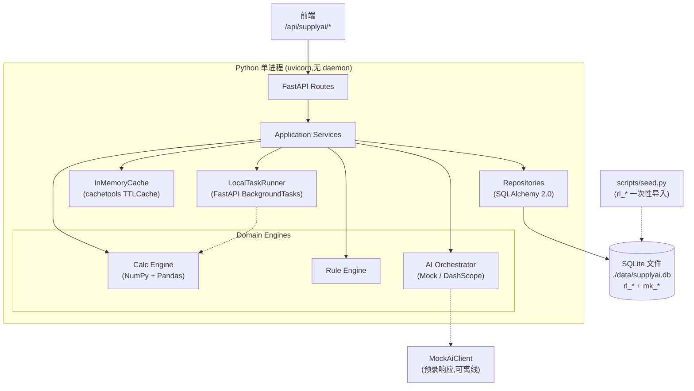
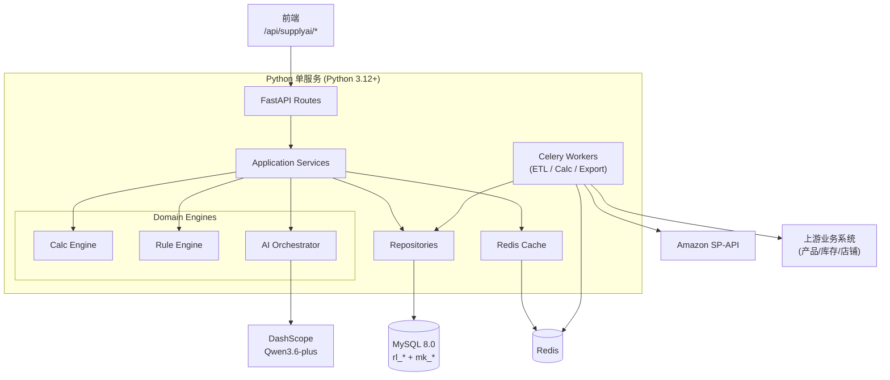

# SupplyAI 后端技术方案（Python 单服务）

更新时间：2026-05-09

相关文档：

- [SupplyAI 数据表设计](./supplyai-data-table-design.md)
- [SupplyAI 字段映射表 v2](./supplyai-field-mapping-v2.md)
- [SupplyAI 决策日志](./supplyai-decisions.md)

## 1. 目标与约束

后端在前端 Phase 4 联调前提供完整的技术蓝图。**所有业务 API 契约以前端技术方案 §7 的全 POST 约定为准，本文档不做改动**，仅给出 Python 实现路线。

| 项 | 决策（本地 / 生产） |
|---|---|
| 形态 | **单一 Python 服务**（API + Calc + AI + 后台任务） |
| 规模假设 | DAU < 500，AI QPS < 20，单次 calc_run < 1 分钟 |
| 拆分阈值 | 超过上述任一阈值再拆 AI 服务 / Calc Worker（参考 §16） |
| **数据库（本地）** | **SQLite**（macOS 自带，零 daemon，文件存储） |
| **数据库（生产）** | **MySQL 8.0+** |
| **后台任务（本地）** | **FastAPI BackgroundTasks**（同进程异步） |
| **后台任务（生产）** | Celery + Redis（演示 / 联调阶段再启用） |
| **缓存（本地）** | **进程内 LRU**（cachetools） |
| **缓存（生产）** | Redis |
| **容器（本地）** | **不使用 Docker**，`uv run uvicorn` 直跑 |
| **容器（生产）** | docker-compose / K8s |
| AI 外部 | 阿里 DashScope（Qwen3.6-plus）；本地可切 `AI_PROVIDER=mock` 完全离线 |
| 上游 | Amazon SP-API + 上游业务系统（产品 / 库存 / 店铺，**当前设计通过数据表离线同步进 SupplyAI 本地 DB，无运行时调用**） |
| **本地切生产** | 仅修改 `DATABASE_URL` + `AI_PROVIDER`，业务代码 0 改动（SQLAlchemy 抽象层兼容） |

> **本地开发原则**：`uv run uvicorn supplyai.main:app --reload` 一行命令启动。无 Docker、无 Redis daemon、无 Celery worker、无 MySQL daemon。详见 §16.0。

---

## 2. 整体架构

### 2.1 本地形态（macOS 直跑）



### 2.2 生产形态（Phase 4-5）



**两种形态的差异仅在三个抽象点**：`CacheClient` / `TaskRunner` / `AiClient`，业务代码 0 修改。详见 §11 / §12 / §16.0。

**层职责边界**：

| 层 | 责任 | 不做 |
|---|---|---|
| API (FastAPI) | 路由、参数校验（Pydantic）、依赖注入、响应封装 | 业务逻辑、SQL |
| Services | 编排多个 domain 操作、事务边界、缓存读写 | 算法实现、原始 SQL |
| Domain (Calc/Rule/AI) | 纯业务规则与算法，不直接读 DB | DB 访问、HTTP |
| Repositories | SQLAlchemy 查询封装、ORM ↔ DTO 转换 | 业务规则 |
| Schemas (Pydantic) | DTO 定义（snake_case）、自动 OpenAPI、运行时校验 | 业务逻辑 |
| Workers (Celery) | ETL、定时 calc_run、异步导出、AI 长任务 | 同步 API 响应 |

---

## 3. 项目结构

```text
supplyai-backend/
├── pyproject.toml                # uv 管理依赖（默认仅本地依赖,prod extras 单独装）
├── alembic.ini
├── Dockerfile                    # 仅生产用
├── docker-compose.yml            # 仅生产 staging:api + db + redis + celery
├── .env.example                  # 含本地 / 生产两套配置示例
├── data/                         # 本地 SQLite 文件存放(gitignored)
│   └── supplyai.db
├── README.md
├── scripts/
│   ├── seed.py                   # 本地 rl_* 演示数据生成 + 写入 SQLite
│   ├── import_dump.py            # 从生产 MySQL dump 翻译进本地 SQLite
│   └── export_openapi.py         # 导出 OpenAPI 给前端 zod 生成
│
├── alembic/                      # DB migration
│   ├── env.py
│   └── versions/
│       ├── 0001_initial_rl_tables.py
│       ├── 0002_initial_mk_tables.py
│       ├── 0003_calc_run_id_index.py
│       └── ...
│
├── src/
│   └── supplyai/
│       ├── __init__.py
│       ├── main.py               # FastAPI app entry
│       ├── config.py             # pydantic-settings
│       ├── deps.py               # FastAPI Depends (db session, current_user, services)
│       │
│       ├── api/
│       │   └── v1/
│       │       ├── __init__.py
│       │       ├── calc.py       # /api/supplyai/calc/*
│       │       ├── dashboard.py  # /api/supplyai/dashboard/*
│       │       ├── skus.py       # /api/supplyai/skus/*
│       │       ├── rules.py      # /api/supplyai/rules/*
│       │       ├── ai.py         # /api/supplyai/ai/*
│       │       ├── purchase.py
│       │       └── exports.py
│       │
│       ├── schemas/              # Pydantic DTO (snake_case)
│       │   ├── common.py         # PageResult, DataQuality, Currency
│       │   ├── calc.py           # CalcRunDTO, CalcRunStatusDTO
│       │   ├── sku.py            # SkuSummaryDTO, SkuDetailDTO, StockBreakdownDTO
│       │   ├── trend.py          # SalesTrendPointDTO, ForecastTrendPointDTO
│       │   ├── dashboard.py      # DashboardSnapshotDTO
│       │   ├── rule.py           # RuleConfigDTO, RuleSaveResultDTO
│       │   ├── ai.py             # AiAnswerDTO, AiAskRequestDTO
│       │   ├── purchase.py
│       │   └── export.py
│       │
│       ├── models/               # SQLAlchemy ORM
│       │   ├── base.py           # DeclarativeBase + Naming convention
│       │   ├── rl/               # 真实源表(只读)
│       │   │   ├── mall.py
│       │   │   ├── amz_all_listing.py
│       │   │   ├── amz_listing_detail.py
│       │   │   ├── product.py
│       │   │   ├── amz_sales_daily_report.py
│       │   │   ├── amz_manage_fba_inventory.py
│       │   │   ├── inventory_detail.py
│       │   │   └── amz_finances_profit.py
│       │   └── mk/               # 项目派生表
│       │       ├── tenant_config.py
│       │       ├── warehouse_mapping.py
│       │       ├── listing_product_sources.py
│       │       ├── replenishment_rule.py
│       │       ├── rule_logistics_method.py
│       │       ├── forecast_rule.py
│       │       ├── calc_run.py
│       │       ├── supply_sku_daily_stat.py
│       │       ├── sku_forecast_daily.py
│       │       ├── sku_inbound_detail.py
│       │       ├── stockout_event.py
│       │       ├── purchase_draft.py
│       │       └── export_task.py
│       │
│       ├── repositories/
│       │   ├── base.py           # BaseRepository[Model]
│       │   ├── sku_repo.py       # 查询 mk_supply_sku_daily_stat + listing_product_sources
│       │   ├── listing_repo.py   # 查询 rl_* listing 三表
│       │   ├── sales_repo.py     # 查询 rl_amz_sales_daily_report
│       │   ├── inventory_repo.py # 查询 rl_inventory_detail + rl_amz_manage_fba_inventory
│       │   ├── rule_repo.py
│       │   ├── forecast_repo.py
│       │   ├── calc_run_repo.py
│       │   ├── stockout_repo.py
│       │   └── export_repo.py
│       │
│       ├── services/             # Application Services
│       │   ├── calc_service.py   # 编排 calc_run 状态查询
│       │   ├── dashboard_service.py
│       │   ├── sku_service.py
│       │   ├── rule_service.py   # 包括保存 + 触发重算
│       │   ├── ai_service.py
│       │   ├── purchase_service.py
│       │   └── export_service.py
│       │
│       ├── domain/
│       │   ├── calc_engine/
│       │   │   ├── __init__.py
│       │   │   ├── forecasting.py    # 销量预测(固定/动态/默认/去噪/原始)
│       │   │   ├── denoise.py        # 异常时间 + 异常销量过滤
│       │   │   ├── coverage.py       # 覆盖周期 / 覆盖周期需求量
│       │   │   ├── stock.py          # total_stock 聚合
│       │   │   ├── risk.py           # 风险等级派生
│       │   │   ├── financial.py      # SKU 级财务分摊
│       │   │   ├── fx.py             # 多币种折算
│       │   │   └── runner.py         # 完整 calc_run 编排
│       │   │
│       │   ├── rule_engine/
│       │   │   ├── __init__.py
│       │   │   ├── resolver.py       # global/store/sku 三层解析
│       │   │   ├── validator.py      # 保存校验
│       │   │   └── version.py        # rule_version 生成
│       │   │
│       │   └── ai/
│       │       ├── __init__.py
│       │       ├── orchestrator.py   # 主编排逻辑
│       │       ├── tools.py          # 4 个 Tool 实现
│       │       ├── prompts.py        # System prompt + Foundation Skills
│       │       ├── dashscope_client.py
│       │       └── confirmation.py   # generate_purchase_draft 三参数确认
│       │
│       ├── tasks/                   # 任务调度抽象（本地 BackgroundTasks / 生产 Celery）
│       │   ├── runner.py            # TaskRunner 接口：本地用 FastAPI BackgroundTasks，生产用 Celery
│       │   ├── local_runner.py      # 本地实现：BackgroundTasks + apscheduler 触发
│       │   ├── celery_runner.py     # 生产实现：Celery + Redis（Phase 4 启用）
│       │   ├── jobs/                # 任务实现，runner 无关
│       │   │   ├── calc_scheduled.py
│       │   │   ├── calc_rule_changed.py
│       │   │   ├── stockout_detect.py
│       │   │   └── export_task.py
│       │   └── etl/
│       │       ├── amazon_sp_api.py # 仅生产启用；本地 rl_* 走 seed 导入
│       │       └── upstream_sync.py # 仅生产启用
│       │
│       ├── cache/
│       │   ├── interface.py         # CacheClient 接口
│       │   ├── in_memory.py         # 本地实现：cachetools TTLCache
│       │   ├── redis_cache.py       # 生产实现（Phase 4 启用）
│       │   ├── keys.py              # cache key 生成 + calc_run_id 强约束
│       │   └── invalidator.py       # 全域失效逻辑
│       │
│       ├── auth/
│       │   ├── jwt.py
│       │   ├── permissions.py        # Phase 4 完整权限
│       │   └── tenant.py             # 租户隔离中间件
│       │
│       └── utils/
│           ├── time.py               # 租户时区处理
│           ├── currency.py
│           ├── logging.py
│           └── exceptions.py         # 业务异常类
│
├── tests/
│   ├── conftest.py
│   ├── factories/                    # factory-boy 数据工厂
│   ├── api/
│   │   ├── test_skus.py
│   │   ├── test_rules.py
│   │   └── ...
│   ├── services/
│   ├── domain/
│   │   ├── calc_engine/
│   │   │   ├── test_forecasting.py
│   │   │   ├── test_denoise.py
│   │   │   ├── test_coverage.py
│   │   │   └── test_risk.py
│   │   └── ai/
│   │       └── test_orchestrator.py  # vcrpy 录制 DashScope
│   └── repositories/
│
└── scripts/
    ├── seed_demo_data.py             # 演示数据生成
    └── export_openapi.py             # 导出 OpenAPI 给前端 zod 生成
```

---

## 4. 技术栈版本

### 4.1 本地必需（macOS 直跑，Phase 2-3）

| 类别 | 包 | 版本 | 备注 |
|---|---|---|---|
| 语言 | Python | **3.12+** | PEP 695、faster CPython |
| 包管理 | uv | latest | 比 poetry 快 10x，单二进制 |
| Web | fastapi | ^0.115 | async + OpenAPI |
| ASGI | uvicorn | ^0.32 | dev / prod |
| ORM | sqlalchemy | ^2.0 | async session，SQLite/MySQL 双兼容 |
| Migration | alembic | ^1.14 | autogenerate |
| **SQLite 驱动** | **aiosqlite** | **latest** | **async SQLite，stdlib + 异步包装** |
| Validation | pydantic | ^2.10 | v2 性能 +5x |
| Settings | pydantic-settings | ^2.6 | .env 加载 |
| 数值 | pandas | ^2.2 | DataFrame |
| 数值 | numpy | ^2.0 | 数组 |
| **本地缓存** | **cachetools** | **^5** | **进程内 LRU/TTL** |
| HTTP 客户端 | httpx | ^0.28 | 外部 API（DashScope / future ETL） |
| 日志 | structlog | ^24 | JSON 结构化 |
| 测试 | pytest | ^8 | + pytest-asyncio |
| 类型检查 | mypy | ^1.13 | --strict |
| Lint/Format | ruff | ^0.7 | 替代 black + flake8 |

### 4.2 生产追加（Phase 4-5）

| 类别 | 包 | 版本 | 启用阶段 |
|---|---|---|---|
| WSGI/进程 | gunicorn | ^23 | 生产，UvicornWorker |
| **MySQL 驱动** | aiomysql | latest | 切到 MySQL 时 |
| AI SDK（真实） | dashscope | ^1.20 | 切到 `AI_PROVIDER=dashscope` 时 |
| 后台任务 | celery | ^5.4 | 切到 `TASK_RUNNER=celery` 时 |
| Broker / Cache | redis | ^5.2 | 切到 `CACHE_BACKEND=redis` 时 |
| Auth | pyjwt | ^2.10 | 鉴权启用时 |
| 测试数据 | factory-boy | ^3 | 集成测试 |
| AI 录制 | vcrpy | ^6 | DashScope 测试 |
| 监控 | opentelemetry | latest | 生产链路 |

通过 `pyproject.toml` 的 `[project.optional-dependencies]` 区分：

```toml
[project]
dependencies = [
    "fastapi>=0.115", "uvicorn>=0.32", "sqlalchemy>=2.0",
    "aiosqlite", "alembic>=1.14", "pydantic>=2.10",
    "pydantic-settings>=2.6", "pandas>=2.2", "numpy>=2.0",
    "cachetools>=5", "httpx>=0.28", "structlog>=24",
]

[project.optional-dependencies]
prod = ["gunicorn>=23", "aiomysql", "dashscope>=1.20", "celery>=5.4", "redis>=5.2", "pyjwt>=2.10"]
dev = ["pytest>=8", "pytest-asyncio", "mypy>=1.13", "ruff>=0.7", "factory-boy>=3", "vcrpy>=6"]
```

本地开发：`uv sync`（默认）。生产部署：`uv sync --extra prod`。

---

## 5. ORM 模型设计原则

### 5.1 基类与命名规约

```python
# src/supplyai/models/base.py
from sqlalchemy.orm import DeclarativeBase, MappedAsDataclass
from sqlalchemy import MetaData

NAMING_CONVENTION = {
    "ix": "ix_%(table_name)s_%(column_0_name)s",
    "uq": "uq_%(table_name)s_%(column_0_name)s",
    "ck": "ck_%(table_name)s_%(constraint_name)s",
    "fk": "fk_%(table_name)s_%(column_0_name)s_%(referred_table_name)s",
    "pk": "pk_%(table_name)s",
}

class Base(MappedAsDataclass, DeclarativeBase):
    metadata = MetaData(naming_convention=NAMING_CONVENTION)
```

### 5.2 真实源表（rl_*）只读模型

```python
# src/supplyai/models/rl/amz_all_listing.py
from datetime import datetime
from decimal import Decimal
from sqlalchemy import BigInteger, String, DateTime, Numeric, Index
from sqlalchemy.orm import Mapped, mapped_column

class RlAmzAllListing(Base):
    __tablename__ = "rl_amz_all_listing"
    __table_args__ = (
        Index("uq_rl_amz_all_listing_tmm", "tenant_id", "msku", "mall_id", unique=True),
    )
    
    listing_id: Mapped[int] = mapped_column(BigInteger, primary_key=True)
    tenant_id: Mapped[int | None] = mapped_column(BigInteger)
    mall_id: Mapped[int | None] = mapped_column(BigInteger)
    msku: Mapped[str] = mapped_column(String(50))
    asin: Mapped[str | None] = mapped_column(String(15))
    item_name: Mapped[str | None] = mapped_column(String)
    delivery_method: Mapped[str | None] = mapped_column(String(5))
    price: Mapped[Decimal | None] = mapped_column(Numeric(10, 2))
    default_currency: Mapped[str] = mapped_column(String(20), default="")
    status: Mapped[str | None] = mapped_column(String(15), default="INACTIVE")
    open_date: Mapped[datetime | None]
    # ... 其余字段按真实表 DDL 镜像
    
    __mapper_args__ = {"eager_defaults": True}
```

### 5.3 大写字段名兼容（来自数据表设计 §5.5）

`rl_inventory_detail.Inventory_value` / `mall_Identify_code` 真实大写：

```python
class RlInventoryDetail(Base):
    __tablename__ = "rl_inventory_detail"
    
    detail_id: Mapped[int] = mapped_column(BigInteger, primary_key=True)
    inventory_value: Mapped[Decimal | None] = mapped_column(
        "Inventory_value",  # 显式指定数据库列名
        Numeric(24, 4),
    )
    mall_identify_code: Mapped[str | None] = mapped_column(
        "mall_Identify_code",
        String(30),
    )
```

ORM 层用统一小写命名，DB 层保留真实大写。

### 5.4 派生表（mk_*）完整模型

```python
# src/supplyai/models/mk/supply_sku_daily_stat.py
class MkSupplySkuDailyStat(Base):
    __tablename__ = "mk_supply_sku_daily_stat"
    __table_args__ = (
        Index(
            "uq_mk_supply_sku_daily_stat_run_tmm",
            "calc_run_id", "tenant_id", "mall_id", "msku",
            unique=True,
        ),
        Index("ix_mk_supply_sku_daily_stat_risk", "risk_level"),
        Index("ix_mk_supply_sku_daily_stat_stockout", "stockout_date"),
    )
    
    id: Mapped[int] = mapped_column(BigInteger, primary_key=True, autoincrement=True)
    calc_run_id: Mapped[str] = mapped_column(String(64))
    tenant_id: Mapped[int]
    listing_id: Mapped[int | None]
    mall_id: Mapped[int | None]
    msku: Mapped[str]
    delivery_method: Mapped[str | None] = mapped_column(String(20))
    risk_level: Mapped[str] = mapped_column(String(10))   # 'p1'/'p2'/'p3'/'safe'
    
    # FBA 库存
    fba_available: Mapped[int | None]
    fba_inbound_working: Mapped[int | None]
    fba_inbound_shipped: Mapped[int | None]
    fba_inbound_receiving: Mapped[int | None]
    fba_reserved: Mapped[int | None]
    
    # 本地库存
    local_actual: Mapped[int | None]
    local_plan: Mapped[int | None]
    
    # 计算结果
    total_stock: Mapped[int | None]
    sellable_days: Mapped[Decimal | None] = mapped_column(Numeric(10, 2))
    fba_sellable_days: Mapped[Decimal | None] = mapped_column(Numeric(10, 2))
    forecast_daily: Mapped[Decimal | None] = mapped_column(Numeric(10, 2))
    coverage_demand: Mapped[Decimal | None] = mapped_column(Numeric(12, 2))
    suggest_qty: Mapped[int | None]
    
    # 多币种
    currency: Mapped[str | None] = mapped_column(String(10))
    base_currency: Mapped[str | None] = mapped_column(String(10))
    fx_rate_to_base: Mapped[Decimal | None] = mapped_column(Numeric(18, 8))
    suggest_amount_base: Mapped[Decimal | None] = mapped_column(Numeric(14, 2))
    
    # 财务
    financial_estimate_type: Mapped[str | None] = mapped_column(String(20))
    
    # 元数据
    updated_at: Mapped[datetime | None]
    source_type: Mapped[str | None] = mapped_column(String(20))
```

---

## 6. Pydantic Schemas（DTO）

### 6.1 命名约定

- DTO 字段统一 **snake_case**（与前端技术方案 §7 / 字段映射 v2 一致）
- 每个 ViewModel 一个 schema 文件
- `BaseModel.model_config = ConfigDict(from_attributes=True)` 让 ORM → DTO 直接转换

### 6.2 共享类型

```python
# src/supplyai/schemas/common.py
from typing import Generic, Literal, TypeVar
from pydantic import BaseModel, ConfigDict
from datetime import datetime

T = TypeVar("T")

class PageResult(BaseModel, Generic[T]):
    rows: list[T]
    total: int
    page: int
    page_size: int

class DataQuality(BaseModel):
    missing_fields: list[str] = []
    warnings: list["DataQualityWarning"] = []

class DataQualityWarning(BaseModel):
    code: str
    field: str | None = None
    message: str
    severity: Literal["info", "warn", "error"] = "warn"

class CurrencyAmount(BaseModel):
    currency: str
    amount: float

class SuggestTotalAmount(BaseModel):
    base: CurrencyAmount
    by_currency: list[CurrencyAmount] = []
    fx_rate_as_of: datetime | None = None
```

### 6.3 SkuSummary

```python
# src/supplyai/schemas/sku.py
class SkuSummaryDTO(BaseModel):
    model_config = ConfigDict(from_attributes=True)
    
    listing_id: int
    calc_run_id: str
    tenant_id: int
    mall_id: int | None
    msku: str
    sku: str | None
    asin: str | None
    fnsku: str | None
    title: str | None
    product_name: str | None
    image_url: str | None
    brand: str | None
    category: str | None
    owner: str | None
    
    delivery_method: Literal["FBA", "FBM"] | None
    listing_status: str | None
    
    risk_level: Literal["p1", "p2", "p3", "safe"]
    yesterday_sales: int | None
    forecast_daily: float | None
    forecast_source: str | None
    coverage_demand: float | None
    
    sellable_days: float | None
    fba_sellable_days: float | None
    local_sellable_days: float | None
    
    stockout_date: date | None
    suggest_purchase_date: date | None
    suggest_purchase: bool
    suggest_qty: int
    suggest_amount_base: float | None
    base_currency: str | None
    
    last_updated: datetime
```

FastAPI 启动时自动导出 OpenAPI；前端用 `datamodel-code-generator` 或 `openapi-typescript` + `zod-from-openapi` 生成 zod schema，**前后端类型永远同步**。

---

## 7. API 层（FastAPI Routes）

### 7.1 SKU 路由示例

```python
# src/supplyai/api/v1/skus.py
from typing import Annotated
from fastapi import APIRouter, Depends
from supplyai.schemas.sku import SkuSummaryDTO, SkuDetailDTO, SkuListRequest, SkuDetailRequest
from supplyai.schemas.common import PageResult
from supplyai.services.sku_service import SkuService
from supplyai.deps import get_sku_service

router = APIRouter(prefix="/skus", tags=["SKU"])

@router.post("/list", response_model=PageResult[SkuSummaryDTO])
async def list_skus(
    req: SkuListRequest,
    service: Annotated[SkuService, Depends(get_sku_service)],
) -> PageResult[SkuSummaryDTO]:
    """备货计划列表(Phase 1 仅返回 delivery_method = 'FBA')."""
    return await service.list_skus(req)

@router.post("/detail", response_model=SkuDetailDTO)
async def get_sku_detail(
    req: SkuDetailRequest,
    service: Annotated[SkuService, Depends(get_sku_service)],
) -> SkuDetailDTO:
    """SKU 详情。FBM 命中时返回基础信息 + unsupported_reason."""
    return await service.detail(req)
```

### 7.2 依赖注入

```python
# src/supplyai/deps.py
from typing import Annotated, AsyncGenerator
from fastapi import Depends
from sqlalchemy.ext.asyncio import AsyncSession, async_sessionmaker

async def get_db_session() -> AsyncGenerator[AsyncSession, None]:
    async with async_session() as session:
        yield session

def get_sku_service(
    session: Annotated[AsyncSession, Depends(get_db_session)],
    cache: Annotated[CacheClient, Depends(get_cache)],
) -> SkuService:
    return SkuService(
        sku_repo=SkuRepository(session),
        listing_repo=ListingRepository(session),
        forecast_repo=ForecastRepository(session),
        cache=cache,
    )
```

### 7.3 全局异常处理

```python
# src/supplyai/main.py
@app.exception_handler(BusinessException)
async def business_exception_handler(request, exc: BusinessException):
    return JSONResponse(
        status_code=exc.http_status,
        content={"code": exc.code, "message": exc.message},
    )

@app.exception_handler(Exception)
async def generic_exception_handler(request, exc: Exception):
    logger.exception("Unhandled error", path=request.url.path)
    return JSONResponse(
        status_code=500,
        content={"code": "INTERNAL_ERROR", "message": "服务器内部错误"},
    )
```

---

## 8. Calc Engine

### 8.1 Forecasting（销量预测优先级）

```python
# src/supplyai/domain/calc_engine/forecasting.py
from dataclasses import dataclass
from typing import Literal
import pandas as pd
import numpy as np

ForecastSource = Literal["fixed", "dynamic", "default", "denoised", "raw"]

@dataclass
class ForecastResult:
    forecast_daily: float            # 最终未来平均日销
    forecast_source: ForecastSource  # 来源标识
    forecast_qty_array: list[float]  # 未来逐日预测
    last_7d_raw_daily: float
    last_7d_denoised_daily: float | None

class ForecastEngine:
    def predict(
        self,
        sku_msku: str,
        rule: ForecastRule,
        historical: pd.DataFrame,   # columns: [stat_date, sales_volume]
        future_window_days: int = 45,
    ) -> ForecastResult:
        """
        优先级: fixed > dynamic > default > denoised > raw
        参考: 数据表设计 §4.7 + 备货计划需求文档第六章
        """
        # 1. 去噪
        denoised = self._denoise(historical, rule)
        last_7d_raw = historical.tail(7)["sales_volume"].mean()
        last_7d_denoised = (
            denoised.tail(7)["sales_volume"].mean()
            if rule.denoise_enabled and len(denoised) >= 3
            else None
        )
        
        # 2. 按优先级计算 forecast_daily
        if rule.forecast_mode == "fixed" and rule.fixed_daily_sales is not None:
            forecast_daily = float(rule.fixed_daily_sales)
            source: ForecastSource = "fixed"
        
        elif rule.forecast_mode == "dynamic":
            forecast_daily = self._dynamic_weighted(denoised, rule)
            source = "dynamic"
        
        elif rule.default_daily_sales is not None:
            forecast_daily = float(rule.default_daily_sales)
            source = "default"
        
        elif last_7d_denoised is not None and last_7d_denoised > 0:
            forecast_daily = last_7d_denoised
            source = "denoised"
        
        else:
            forecast_daily = max(last_7d_raw, 0.0)
            source = "raw"
        
        # 3. 生成未来逐日数组（这里简化为均匀，实际可加节日/季节调整）
        forecast_qty_array = [forecast_daily] * future_window_days
        
        return ForecastResult(
            forecast_daily=forecast_daily,
            forecast_source=source,
            forecast_qty_array=forecast_qty_array,
            last_7d_raw_daily=last_7d_raw,
            last_7d_denoised_daily=last_7d_denoised,
        )
    
    def _dynamic_weighted(
        self, denoised: pd.DataFrame, rule: ForecastRule,
    ) -> float:
        avg_3d = denoised.tail(3)["sales_volume"].mean()
        avg_7d = denoised.tail(7)["sales_volume"].mean()
        avg_15d = denoised.tail(15)["sales_volume"].mean()
        avg_30d = denoised.tail(30)["sales_volume"].mean()
        
        return float(
            avg_3d * rule.weight_3d / 100
            + avg_7d * rule.weight_7d / 100
            + avg_15d * rule.weight_15d / 100
            + avg_30d * rule.weight_30d / 100
        )
    
    def _denoise(self, df: pd.DataFrame, rule: ForecastRule) -> pd.DataFrame:
        if not rule.denoise_enabled:
            return df
        
        result = df.copy()
        
        # 异常时间段
        for period in rule.abnormal_dates_json or []:
            mask = (result["stat_date"] >= period["from"]) & (
                result["stat_date"] <= period["to"]
            )
            result.loc[mask, "sales_volume"] = period.get("corrected_value", 0)
        
        # 异常销量阈值
        if rule.abnormal_sales_rule_json:
            threshold = rule.abnormal_sales_rule_json["threshold"]
            corrected = rule.abnormal_sales_rule_json["corrected_value"]
            mask = result["sales_volume"] > threshold
            result.loc[mask, "sales_volume"] = corrected
        
        # 有效样本不足 3 天则放弃去噪
        if len(result) < 3:
            return df
        
        return result
```

### 8.2 Coverage / Stock / Risk

```python
# src/supplyai/domain/calc_engine/coverage.py
def compute_coverage_demand(
    forecast_daily: float,
    lead_time_days: int,
    safety_days: int,
) -> float:
    """覆盖周期需求量 = forecast_daily × (lead_time + safety)"""
    return forecast_daily * (lead_time_days + safety_days)

# src/supplyai/domain/calc_engine/stock.py
def compute_total_stock(fba: FbaInventory, local: LocalInventory) -> int:
    """
    total_stock = fba_available + working + shipped + receiving + local_actual + local_plan
    不含 fba_reserved
    参考: 数据表设计 §4.7 line 271-276
    """
    return (
        fba.available
        + fba.inbound_working
        + fba.inbound_shipped
        + fba.inbound_receiving
        + local.actual
        + local.plan
    )

def compute_fba_sellable_days(fba: FbaInventory, forecast_daily: float) -> float | None:
    if forecast_daily <= 0:
        return None
    fba_total = (
        fba.available
        + fba.inbound_working
        + fba.inbound_shipped
        + fba.inbound_receiving
    )
    return fba_total / forecast_daily

def compute_sellable_days(total_stock: int, forecast_daily: float) -> float | None:
    if forecast_daily <= 0:
        return None
    return total_stock / forecast_daily

# src/supplyai/domain/calc_engine/risk.py
RiskLevel = Literal["p1", "p2", "p3", "safe"]

def compute_risk_level(fba_sellable_days: float | None) -> RiskLevel:
    """
    P1: ≤7
    P2: 8-15
    P3: 16-30
    safe: >30 或 None
    
    参考: 数据表设计 §4.7 + 需求文档第二章
    """
    if fba_sellable_days is None:
        return "safe"
    if fba_sellable_days <= 7:
        return "p1"
    if fba_sellable_days <= 15:
        return "p2"
    if fba_sellable_days <= 30:
        return "p3"
    return "safe"

# src/supplyai/domain/calc_engine/runner.py
import math

def compute_suggest_qty(coverage_demand: float, total_stock: int) -> int:
    """suggest_qty = CEIL(max(0, coverage_demand - total_stock))"""
    return math.ceil(max(0, coverage_demand - total_stock))
```

### 8.3 完整 calc_run 编排

```python
# src/supplyai/domain/calc_engine/runner.py
class CalcRunner:
    def __init__(
        self,
        listing_repo: ListingRepository,
        sales_repo: SalesRepository,
        inventory_repo: InventoryRepository,
        rule_resolver: RuleResolver,
        forecast_engine: ForecastEngine,
        finance_allocator: FinancialAllocator,
        fx_service: FxService,
        snapshot_repo: SkuDailyStatRepository,
        forecast_daily_repo: ForecastDailyRepository,
        calc_run_repo: CalcRunRepository,
    ):
        ...
    
    async def run(
        self,
        tenant_id: int,
        run_type: Literal["scheduled", "rule_changed", "manual"],
        scope: CalcScope | None = None,
    ) -> str:
        """
        完整 calc_run 流程:
        1. 创建 calc_run 记录(status=running)
        2. 锁 calc_run_id 给本批次
        3. 加载 SKU 列表(Phase 1 只 FBA)
        4. 并行计算每个 SKU(asyncio.gather + semaphore 限并发)
        5. 同事务写入 mk_supply_sku_daily_stat + mk_sku_forecast_daily
        6. 更新 calc_run.status = success
        7. 返回 calc_run_id
        """
        calc_run_id = self._generate_run_id(tenant_id)
        
        await self.calc_run_repo.create(
            calc_run_id=calc_run_id,
            tenant_id=tenant_id,
            run_type=run_type,
            status="running",
        )
        
        try:
            # 加载 SKU 列表(只 FBA)
            skus = await self.listing_repo.list_active_fba(tenant_id, scope)
            
            # 并行计算(限并发避免压垮 DB / Pandas)
            sem = asyncio.Semaphore(20)
            
            async def compute_one(sku):
                async with sem:
                    return await self._compute_sku_snapshot(sku, calc_run_id)
            
            results = await asyncio.gather(*(compute_one(s) for s in skus))
            
            # 同事务批量写入
            async with self.calc_run_repo.transaction():
                await self.snapshot_repo.bulk_insert(results.snapshots)
                await self.forecast_daily_repo.bulk_insert(results.forecasts)
                await self.calc_run_repo.update_status(
                    calc_run_id, status="success",
                )
            
            return calc_run_id
        
        except Exception as e:
            await self.calc_run_repo.update_status(
                calc_run_id, status="failed", error_message=str(e),
            )
            raise
    
    async def _compute_sku_snapshot(
        self, sku: ListingProductSource, calc_run_id: str,
    ) -> SkuSnapshotResult:
        # 加载历史销量
        historical = await self.sales_repo.fetch_historical(
            tenant_id=sku.tenant_id, mall_id=sku.mall_id, msku=sku.msku,
            days=180,
        )
        
        # 解析规则
        replenish_rule = await self.rule_resolver.resolve_replenishment(
            sku.tenant_id, sku.mall_id, sku.msku,
        )
        forecast_rule = await self.rule_resolver.resolve_forecast(
            sku.tenant_id, sku.mall_id, sku.msku,
        )
        
        # 销量预测
        forecast = self.forecast_engine.predict(sku.msku, forecast_rule, historical)
        
        # 库存
        fba = await self.inventory_repo.fetch_fba(sku.tenant_id, sku.mall_id, sku.msku)
        local = await self.inventory_repo.fetch_local(
            sku.tenant_id, sku.mall_id, sku.msku,  # 用 mk_warehouse_mapping 过滤
        )
        
        # 计算
        total_stock = compute_total_stock(fba, local)
        sellable_days = compute_sellable_days(total_stock, forecast.forecast_daily)
        fba_sellable_days = compute_fba_sellable_days(fba, forecast.forecast_daily)
        
        lead_time = (
            replenish_rule.purchase_duration_days
            + replenish_rule.delivery_days
            + replenish_rule.qc_days
            + replenish_rule.max_logistics_days
        )
        coverage_demand = compute_coverage_demand(
            forecast.forecast_daily, lead_time, replenish_rule.safety_days,
        )
        suggest_qty = compute_suggest_qty(coverage_demand, total_stock)
        risk_level = compute_risk_level(fba_sellable_days)
        
        # 财务分摊
        finance = await self.finance_allocator.allocate(sku, calc_run_id)
        
        # 多币种
        fx = await self.fx_service.get_rate(sku.currency, base="USD")
        suggest_amount = suggest_qty * float(sku.unit_cost or 0)
        
        return SkuSnapshotResult(
            snapshot=MkSupplySkuDailyStatRow(
                calc_run_id=calc_run_id,
                msku=sku.msku,
                listing_id=sku.listing_id,
                # ... 全字段
                forecast_daily=forecast.forecast_daily,
                forecast_source=forecast.forecast_source,
                last_7d_raw_daily=forecast.last_7d_raw_daily,
                last_7d_denoised_daily=forecast.last_7d_denoised_daily,
                total_stock=total_stock,
                sellable_days=sellable_days,
                fba_sellable_days=fba_sellable_days,
                coverage_demand=coverage_demand,
                suggest_qty=suggest_qty,
                risk_level=risk_level,
                suggest_amount_base=suggest_amount * fx.rate,
                base_currency="USD",
                fx_rate_to_base=fx.rate,
                fx_rate_as_of=fx.as_of,
                financial_estimate_type=finance.estimate_type,
                # ...
            ),
            forecasts=[
                MkSkuForecastDailyRow(
                    calc_run_id=calc_run_id,
                    msku=sku.msku,
                    forecast_date=today + timedelta(days=i),
                    day_offset=i,
                    forecast_qty=q,
                    forecast_source=forecast.forecast_source,
                )
                for i, q in enumerate(forecast.forecast_qty_array)
            ],
        )
```

---

## 9. Rule Engine

### 9.1 解析（global / store / sku 三层）

```python
# src/supplyai/domain/rule_engine/resolver.py
class RuleResolver:
    def __init__(
        self,
        replenish_repo: ReplenishmentRuleRepository,
        forecast_repo: ForecastRuleRepository,
    ):
        ...
    
    async def resolve_replenishment(
        self, tenant_id: int, mall_id: int, msku: str,
    ) -> EffectiveReplenishmentRule:
        """
        优先级: SKU 特配 > 店铺规则 > 全局规则 > 系统默认
        """
        # SKU 特配
        sku_rule = await self.replenish_repo.find_one(
            tenant_id=tenant_id, scope_type="sku",
            mall_id=mall_id, msku=msku, enabled=True,
        )
        if sku_rule:
            return self._to_effective(sku_rule)
        
        # 店铺规则
        store_rule = await self.replenish_repo.find_one(
            tenant_id=tenant_id, scope_type="store",
            mall_id=mall_id, enabled=True,
        )
        if store_rule:
            return self._to_effective(store_rule)
        
        # 全局
        global_rule = await self.replenish_repo.find_one(
            tenant_id=tenant_id, scope_type="global", enabled=True,
        )
        if global_rule:
            return self._to_effective(global_rule)
        
        # 系统默认
        return self._system_default()
```

### 9.2 保存与版本

```python
# src/supplyai/services/rule_service.py
class RuleService:
    async def save(self, payload: RuleSavePayload) -> RuleSaveResult:
        """
        参考: 技术方案 §7.4 + §16.6
        返回 affected_count / overwritten_special_count / recalc_status / ...
        """
        # 1. 校验
        errors = self.validator.validate(payload)
        if errors:
            return RuleSaveResult(ok=False, validation_errors=errors)
        
        # 2. 计算受影响 SKU 数 + 覆盖的特配数
        affected_count, overwritten = await self._scan_affected(payload)
        
        # 3. 写入(同事务)
        new_version = self.version_gen.next(payload)
        async with self.repo.transaction():
            if payload.scope_type == "batch":
                # 批量特配 - 覆盖已有特配
                await self.repo.upsert_batch(payload.skus, payload, new_version)
            elif payload.scope_type == "sku":
                await self.repo.upsert_sku(
                    payload.mall_id, payload.msku, payload, new_version,
                )
            elif payload.scope_type == "store":
                await self.repo.upsert_store(payload.mall_id, payload, new_version)
            else:
                await self.repo.upsert_global(payload, new_version)
        
        # 4. 触发重算(异步,Celery)
        from supplyai.workers.calc.rule_changed import calc_run_for_rule
        task = calc_run_for_rule.delay(
            tenant_id=payload.tenant_id,
            scope=payload.to_calc_scope(),
            rule_version=new_version,
        )
        
        return RuleSaveResult(
            ok=True,
            rule_version=new_version,
            calc_run_id=None,  # 异步任务后才有
            affected_count=affected_count,
            overwritten_special_count=overwritten,
            recalc_status="queued",
        )
```

---

## 10. AI Orchestrator

### 10.1 总编排

```python
# src/supplyai/domain/ai/orchestrator.py
class AiOrchestrator:
    def __init__(
        self,
        client: DashScopeClient,
        tools: ToolDispatcher,
        prompts: PromptBuilder,
    ):
        ...
    
    async def ask(self, request: AskRequest) -> AiAnswer:
        """
        参考: 技术方案 §7.5 + 供应链业务场景文档 §4.3
        """
        # 1. 确定计算批次
        calc_run_id = request.context.calc_run_id or await self._latest_calc_run(
            request.context.tenant_id,
        )
        
        # 2. 构建 prompt
        messages = self.prompts.build(
            question=request.question,
            history=request.context.history[-8:],  # 最多 8 轮
            sku_snapshot=await self._fetch_sku_snapshot(request.context),
            foundation_skills=FOUNDATION_SKILLS,
        )
        
        # 3. 调 Qwen,处理 tool calls
        response = await self._invoke_with_tools(messages, calc_run_id)
        
        # 4. 组装 AiAnswer
        return self._compose_answer(response, calc_run_id, request.context)
    
    async def _invoke_with_tools(
        self, messages: list[Message], calc_run_id: str,
    ) -> CompletionResponse:
        for round_idx in range(MAX_TOOL_ROUNDS):  # 防死循环
            response = await self.client.chat(
                model="qwen3.6-plus",
                messages=messages,
                tools=self.tools.get_schemas(),
                max_tokens=1024,
                temperature=0.2,
            )
            
            if not response.has_tool_calls():
                return response
            
            # 执行所有 tool calls
            for tool_call in response.tool_calls:
                # generate_purchase_draft 必须三参数确认拦截
                if tool_call.name == "generate_purchase_draft":
                    if not self._has_confirmed_params(tool_call.arguments):
                        result = ToolResult.confirmation_required(
                            "请先确认 SKU、采购数量、供应商三项参数后重试。"
                        )
                    else:
                        result = await self.tools.execute(tool_call, calc_run_id)
                else:
                    result = await self.tools.execute(tool_call, calc_run_id)
                
                messages.append({
                    "role": "tool",
                    "tool_call_id": tool_call.id,
                    "content": result.to_json(),
                })
        
        # 超过最大轮次 → 降级
        raise AiToolLoopException("Tool calling 超过最大轮次")
```

### 10.2 4 个 Tool

```python
# src/supplyai/domain/ai/tools.py
TOOL_SCHEMAS = [
    {
        "type": "function",
        "function": {
            "name": "query_stockout_risk",
            "description": "查询全局或筛选后的断货风险队列",
            "parameters": {
                "type": "object",
                "properties": {
                    "mall_id": {"type": "integer"},
                    "country_code": {"type": "string"},
                    "owner": {"type": "string"},
                    "limit": {"type": "integer", "default": 10},
                },
            },
        },
    },
    {
        "type": "function",
        "function": {
            "name": "query_replenishment_advice",
            "description": "查询 SKU 或批量 SKU 的备货建议",
            "parameters": {
                "type": "object",
                "properties": {
                    "listing_id": {"type": "integer"},
                    "mall_id": {"type": "integer"},
                    "msku": {"type": "string"},
                },
            },
        },
    },
    {
        "type": "function",
        "function": {
            "name": "query_sku_detail",
            "description": "获取 SKU 详情页结构化快照",
            "parameters": {
                "type": "object",
                "properties": {"listing_id": {"type": "integer"}},
                "required": ["listing_id"],
            },
        },
    },
    {
        "type": "function",
        "function": {
            "name": "generate_purchase_draft",
            "description": (
                "生成采购草稿。**注意**：必须先与用户确认 SKU、数量、供应商三项参数后才能调用，"
                "未确认时拒绝执行。"
            ),
            "parameters": {
                "type": "object",
                "properties": {
                    "listing_id": {"type": "integer"},
                    "qty": {"type": "integer"},
                    "supplier": {"type": "string"},
                    "user_confirmed": {
                        "type": "boolean",
                        "description": "是否已经获得用户对 SKU/数量/供应商的明确确认",
                    },
                },
                "required": ["listing_id", "qty", "supplier", "user_confirmed"],
            },
        },
    },
]


class ToolDispatcher:
    def __init__(
        self, sku_service: SkuService, dashboard_service: DashboardService,
        purchase_service: PurchaseService,
    ):
        ...
    
    async def execute(self, tool_call: ToolCall, calc_run_id: str) -> ToolResult:
        match tool_call.name:
            case "query_stockout_risk":
                return await self._query_stockout_risk(tool_call.arguments, calc_run_id)
            case "query_replenishment_advice":
                return await self._query_replenishment_advice(tool_call.arguments, calc_run_id)
            case "query_sku_detail":
                return await self._query_sku_detail(tool_call.arguments, calc_run_id)
            case "generate_purchase_draft":
                return await self._generate_purchase_draft(tool_call.arguments)
            case _:
                raise UnknownToolException(tool_call.name)
```

### 10.3 Foundation Skills 注入

```python
# src/supplyai/domain/ai/prompts.py
FOUNDATION_SKILLS = """
你是 SupplyAI 的备货决策助手。你必须遵守以下约束：

1. 你只解释 mk_* 派生表中的计算结果和中间值，**不能自行计算最终建议采购量、可售天数、预计断货时间**。
2. 风险等级和预计断货时间使用 FBA 侧口径；建议采购时间和建议采购量使用全链路总库存口径。
3. 引用数据时必须明确 calc_run_id；如果数据缺失或为估算，必须显式说明。
4. 多币种金额使用租户基准币种折算后展示；hover 明细可补 by_currency。
5. 回答必须包含: 结论(conclusion) / 关键因子(factors) / 数据依据(basis) / 限制条件(caveats)。
6. 调用 generate_purchase_draft 工具前**必须**先获得用户对 SKU、数量、供应商三项的明确确认；
   未确认时拒绝执行并提示用户补全参数。
7. 上下文不超过 4K tokens；如超出请优先保留最近 8 轮对话和当前 SKU 的结构化快照。
"""

class PromptBuilder:
    def build(
        self, question: str, history: list[Message],
        sku_snapshot: dict | None, foundation_skills: str,
    ) -> list[Message]:
        messages = [
            {"role": "system", "content": foundation_skills},
        ]
        if sku_snapshot:
            messages.append({
                "role": "system",
                "content": (
                    f"当前 SKU 结构化快照(calc_run_id={sku_snapshot['calc_run_id']}):\n"
                    f"{json.dumps(sku_snapshot, ensure_ascii=False, indent=2)}"
                ),
            })
        messages.extend(history)
        messages.append({"role": "user", "content": question})
        return messages
```

---

## 11. 后台任务

> **本地开发**：使用 FastAPI `BackgroundTasks`（同进程异步），无需 Celery / Redis。详见 §16.0。
> **生产**：使用 Celery + Redis（本节内容），适合多 worker 并行 / 定时调度场景。

### 11.0 任务调度抽象

```python
# src/supplyai/tasks/runner.py
from typing import Protocol, Callable, Awaitable

class TaskRunner(Protocol):
    """统一任务调度接口,本地与生产用不同实现"""
    async def submit(
        self,
        task_fn: Callable[..., Awaitable[None]],
        *args, **kwargs,
    ) -> None: ...

# src/supplyai/tasks/local_runner.py
from fastapi import BackgroundTasks

class LocalTaskRunner:
    def __init__(self, bg: BackgroundTasks):
        self._bg = bg
    
    async def submit(self, task_fn, *args, **kwargs):
        # FastAPI BackgroundTasks 在响应返回后执行,不阻塞 API
        self._bg.add_task(task_fn, *args, **kwargs)

# src/supplyai/tasks/celery_runner.py (生产)
class CeleryTaskRunner:
    async def submit(self, task_fn, *args, **kwargs):
        # 转发到 Celery
        celery_task = celery_app.tasks[task_fn.__name__]
        celery_task.delay(*args, **kwargs)
```

业务代码用 `TaskRunner` 接口：

```python
# src/supplyai/services/rule_service.py
async def save(self, payload: RuleSavePayload, runner: TaskRunner):
    # ... 保存规则 ...
    await runner.submit(calc_rule_changed_job, payload.tenant_id, payload.scope)
```

本地 / 生产差异完全在 runner 实现层，业务代码 0 修改。

### 11.1 Celery 配置（生产）

```python
# src/supplyai/workers/celery_app.py
from celery import Celery
from celery.schedules import crontab
from supplyai.config import settings

celery_app = Celery(
    "supplyai",
    broker=settings.redis_url,
    backend=settings.redis_url,
    include=[
        "supplyai.workers.etl.amazon_sp_api",
        "supplyai.workers.etl.upstream_sync",
        "supplyai.workers.calc.scheduled",
        "supplyai.workers.calc.rule_changed",
        "supplyai.workers.export.export_task",
    ],
)

celery_app.conf.beat_schedule = {
    # 上游同步: 00:30, 12:00, 18:00 (按租户时区)
    "etl-amazon-sp-api-0030": {
        "task": "supplyai.workers.etl.amazon_sp_api.sync_all",
        "schedule": crontab(hour=0, minute=30),
    },
    "etl-amazon-sp-api-1200": {
        "task": "supplyai.workers.etl.amazon_sp_api.sync_all",
        "schedule": crontab(hour=12, minute=0),
    },
    "etl-amazon-sp-api-1800": {
        "task": "supplyai.workers.etl.amazon_sp_api.sync_all",
        "schedule": crontab(hour=18, minute=0),
    },
    # 完整 calc_run: 上游同步完成后
    "calc-scheduled-0145": {
        "task": "supplyai.workers.calc.scheduled.run_for_all_tenants",
        "schedule": crontab(hour=1, minute=45),
    },
}
```

### 11.2 ETL 任务

```python
# src/supplyai/workers/etl/amazon_sp_api.py
@celery_app.task(bind=True, max_retries=3)
def sync_all(self):
    """同步 Amazon SP-API 数据到 rl_* 表"""
    asyncio.run(_sync_all_async())

async def _sync_all_async():
    async with get_session() as session:
        for tenant in await tenant_repo.list_all(session):
            try:
                await sync_listings(tenant, session)
                await sync_sales(tenant, session)
                await sync_fba_inventory(tenant, session)
                await sync_finances(tenant, session)
            except Exception as e:
                logger.exception("ETL failed", tenant_id=tenant.id)
                # 不阻塞其他租户
```

### 11.3 规则变更触发重算

```python
# src/supplyai/workers/calc/rule_changed.py
@celery_app.task
def calc_run_for_rule(tenant_id: int, scope: dict, rule_version: str):
    asyncio.run(_calc_run_async(tenant_id, scope, rule_version))

async def _calc_run_async(tenant_id, scope, rule_version):
    runner = await build_calc_runner()
    calc_run_id = await runner.run(
        tenant_id=tenant_id,
        run_type="rule_changed",
        scope=CalcScope.from_dict(scope),
    )
    # 通知前端(可选: WebSocket / SSE)
    await notify_recalc_complete(tenant_id, calc_run_id)
```

---

## 12. 缓存策略

> **本地开发**：使用 `cachetools.TTLCache` 进程内 LRU 缓存，无需 Redis。
> **生产**：使用 Redis（同节内容），支持多副本共享。

### 12.0 缓存接口抽象

```python
# src/supplyai/cache/interface.py
from typing import Protocol, Any

class CacheClient(Protocol):
    async def get(self, key: str) -> Any | None: ...
    async def set(self, key: str, value: Any, ttl: int = 60) -> None: ...
    async def delete(self, key: str) -> None: ...
    async def invalidate_pattern(self, pattern: str) -> None: ...

# src/supplyai/cache/in_memory.py
from cachetools import TTLCache
from threading import RLock
import fnmatch

class InMemoryCache:
    """本地实现:进程内 LRU,容量 10000,默认 TTL 60s"""
    def __init__(self, maxsize: int = 10_000, default_ttl: int = 60):
        self._cache = TTLCache(maxsize=maxsize, ttl=default_ttl)
        self._lock = RLock()
    
    async def get(self, key: str):
        with self._lock:
            return self._cache.get(key)
    
    async def set(self, key: str, value, ttl: int = 60):
        with self._lock:
            self._cache[key] = value
    
    async def delete(self, key: str):
        with self._lock:
            self._cache.pop(key, None)
    
    async def invalidate_pattern(self, pattern: str):
        with self._lock:
            keys = [k for k in self._cache if fnmatch.fnmatch(k, pattern)]
            for k in keys:
                del self._cache[k]

# src/supplyai/cache/redis_cache.py (生产)
class RedisCache:
    def __init__(self, redis_url: str): ...
    # 与 InMemoryCache 同接口,使用 redis-py async client
```

`config.py` 中根据环境变量切换：

```python
def get_cache() -> CacheClient:
    if settings.cache_backend == "redis":
        return RedisCache(settings.redis_url)
    return InMemoryCache()
```

### 12.1 Cache key 规则

```python
# src/supplyai/cache/keys.py
def make_cache_key(
    *,
    mode: str,                     # "http" | "mock" 由 client 传
    tenant_id: int,
    calc_run_id: str,              # 强制包含
    endpoint: str,                 # "skus.list" / "dashboard.snapshot"
    params: dict,
) -> str:
    """
    cache key = mode + tenant_id + calc_run_id + endpoint + params_hash
    保证不同 calc_run 互不干扰
    """
    params_hash = hashlib.sha1(
        json.dumps(params, sort_keys=True).encode()
    ).hexdigest()[:12]
    return f"{mode}:{tenant_id}:{calc_run_id}:{endpoint}:{params_hash}"
```

### 12.2 失效

```python
# src/supplyai/cache/invalidator.py
class CacheInvalidator:
    async def on_new_calc_run(self, tenant_id: int, calc_run_id: str):
        """新 calc_run 完成时,旧 cache 自然过期(因为 key 含 calc_run_id)"""
        # 可选:主动 SCAN + DEL,加快过期
        async for key in self.redis.scan_iter(match=f"http:{tenant_id}:*"):
            if calc_run_id not in key.decode():
                await self.redis.delete(key)
    
    async def on_rule_save(self, tenant_id: int):
        """规则保存后: 清空所有该 tenant 的 cache"""
        async for key in self.redis.scan_iter(match=f"http:{tenant_id}:*"):
            await self.redis.delete(key)
```

### 12.3 默认 TTL

| 资源 | TTL | 理由 |
|---|---|---|
| `skus.list` / `dashboard.snapshot` | 60s | calc_run 内不变 |
| `skus.detail` | 120s | 详情查询频次低 |
| `skus.trends` | 300s | 趋势数据稳定 |
| `rules.effective` | 600s | 规则保存会主动失效 |
| `ai.ask` | 不缓存 | 每次问题都新生成 |

---

## 13. 鉴权（Phase 4 完整实现）

### 13.1 Phase 1-3 简化版

```python
# src/supplyai/auth/jwt.py
async def get_current_user(
    authorization: Annotated[str | None, Header()] = None,
) -> User:
    if not authorization or not authorization.startswith("Bearer "):
        raise HTTPException(401, "未登录")
    
    token = authorization[7:]
    try:
        payload = jwt.decode(token, settings.jwt_secret, algorithms=["HS256"])
    except jwt.PyJWTError:
        raise HTTPException(401, "Token 无效")
    
    return User(
        user_id=payload["user_id"],
        tenant_id=payload["tenant_id"],
        role=payload.get("role", "operator"),
    )
```

### 13.2 Phase 4 完整权限模型

| 维度 | 实现 |
|---|---|
| 功能权限 | 查看 / 规则 / 采购 / 导出 等按钮级 |
| 数据权限 | 默认 listing 负责人；管理者全可见 |
| 字段权限 | Phase 1 财务字段全员可见 |

---

## 14. 错误处理

### 14.1 业务异常类

```python
# src/supplyai/utils/exceptions.py
class BusinessException(Exception):
    code: str
    message: str
    http_status: int = 400

class CalcRunStaleException(BusinessException):
    code = "CALC_RUN_STALE"
    message = "计算批次已过期,请刷新"
    http_status = 409

class FbmNotSupportedException(BusinessException):
    code = "FBM_NOT_SUPPORTED"
    message = "Phase 1 暂不支持 FBM 备货分析"
    http_status = 200  # 业务降级,不报错
```

### 14.2 AI 降级

```python
# AI 降级返回 HTTP 200 + status='degraded'
# 系统错误才抛 5xx
async def ask(request: AskRequest) -> AiAnswer:
    try:
        return await orchestrator.ask(request)
    except (DashScopeRateLimitException, DashScopeTimeoutException):
        return AiAnswer(
            status="degraded",
            conclusion="AI 服务繁忙,请稍后重试",
            calc_run_id=request.context.calc_run_id,
        )
    # NetworkError / DBError 等系统错误 → 抛出,FastAPI 走 5xx
```

---

## 15. 测试策略

### 15.1 测试金字塔

| 层级 | 工具 | 覆盖目标 |
|---|---|---|
| 单元 | pytest + factory-boy | Calc Engine 算法、Rule Resolver、AI Tools |
| 集成 | pytest + httpx + 真 DB | API → Service → Repo → DB 全链路 |
| AI | vcrpy 录制 DashScope 响应 | AI Orchestrator 行为不依赖外部 API |
| 契约 | OpenAPI snapshot | 前端契约一致性 |

### 15.2 Calc Engine 单元测试示例

```python
# tests/domain/calc_engine/test_forecasting.py
import pandas as pd
import pytest
from supplyai.domain.calc_engine.forecasting import ForecastEngine

@pytest.fixture
def engine():
    return ForecastEngine()

def test_fixed_priority(engine):
    """固定日销量优先级最高"""
    rule = ForecastRule(forecast_mode="fixed", fixed_daily_sales=50)
    historical = pd.DataFrame({"sales_volume": [10] * 30})
    result = engine.predict("MS001", rule, historical)
    assert result.forecast_daily == 50.0
    assert result.forecast_source == "fixed"

def test_dynamic_weighted(engine):
    """动态加权按权重计算"""
    rule = ForecastRule(
        forecast_mode="dynamic",
        weight_3d=20, weight_7d=30, weight_15d=25, weight_30d=25,
    )
    historical = pd.DataFrame({"sales_volume": list(range(1, 31))})
    result = engine.predict("MS001", rule, historical)
    # 验证权重按 3/7/15/30 天均值
    expected = (
        pd.Series([28, 29, 30]).mean() * 0.20
        + pd.Series(range(24, 31)).mean() * 0.30
        + pd.Series(range(16, 31)).mean() * 0.25
        + pd.Series(range(1, 31)).mean() * 0.25
    )
    assert result.forecast_daily == pytest.approx(expected, rel=0.01)
    assert result.forecast_source == "dynamic"

def test_denoise_fallback_on_insufficient_samples(engine):
    """去噪后样本不足 3 天 → 回退原始"""
    rule = ForecastRule(
        forecast_mode="default", default_daily_sales=20, denoise_enabled=True,
    )
    historical = pd.DataFrame({"sales_volume": [5, 10]})
    result = engine.predict("MS001", rule, historical)
    assert result.forecast_source == "default"
```

### 15.3 AI Orchestrator 录制测试

```python
# tests/domain/ai/test_orchestrator.py
import vcr

@vcr.use_cassette("tests/fixtures/ai/stockout_query.yaml")
async def test_query_stockout_risk_via_ai(orchestrator):
    request = AskRequest(
        question="今天哪些 SKU 风险最高?",
        context=AskContext(tenant_id=100228, calc_run_id="DEMO-..."),
    )
    answer = await orchestrator.ask(request)
    assert answer.status == "ok"
    assert "P1" in answer.conclusion or "紧急" in answer.conclusion
```

---

## 16. 部署

### 16.0 本地开发（macOS 直跑，无 Docker）

**目标**：双击 / 一行命令启动，无任何 daemon。

#### 一次性配置

```bash
# 装 uv (一次)
brew install uv

# clone + 装依赖
git clone <supplyai-backend>
cd supplyai-backend
uv sync                                        # 装 Python 依赖

# 准备数据
mkdir -p data
uv run alembic upgrade head                    # 在 SQLite 上建表
uv run python scripts/seed.py                  # 导入演示 rl_* + 初始 mk_* 数据
```

#### 每次启动

```bash
uv run uvicorn supplyai.main:app --reload --port 8000
```

打开 `http://localhost:8000/docs` 看 OpenAPI Swagger，所有 API 直接试。

#### `.env` 本地配置

```bash
# 数据库 - SQLite 文件
DATABASE_URL=sqlite+aiosqlite:///./data/supplyai.db

# AI - 默认 mock 完全离线
AI_PROVIDER=mock                  # mock | dashscope
# DASHSCOPE_API_KEY=sk-...        # 切到 dashscope 时填

# 缓存 - 进程内
CACHE_BACKEND=memory              # memory | redis

# 任务 - FastAPI BackgroundTasks
TASK_RUNNER=local                 # local | celery

# 日志
LOG_LEVEL=INFO
LOG_FORMAT=console                # console | json
```

#### 本地架构（实际运行的）

```
┌──────────────────────────────────────┐
│  Python 单进程 (uvicorn)               │
│                                      │
│  ┌────────────────────────────────┐  │
│  │ FastAPI                        │  │
│  │ ├ API Routes                   │  │
│  │ ├ Services                     │  │
│  │ ├ Calc Engine                  │  │
│  │ ├ Rule Engine                  │  │
│  │ ├ AI Orchestrator              │  │
│  │ ├ InMemoryCache (进程内 LRU)    │  │
│  │ └ LocalTaskRunner              │  │
│  │   (FastAPI BackgroundTasks)    │  │
│  └────────────────────────────────┘  │
│                                      │
│  存储:                                │
│  ./data/supplyai.db (SQLite 文件)     │
└──────────────────────────────────────┘
```

#### 触发 calc_run（本地无 Celery beat）

| 场景 | 触发方式 |
|---|---|
| 规则保存后 | 接口内部 `BackgroundTasks` 自动触发 |
| 演示前手动一次 | `POST /api/supplyai/calc/run`（暴露的 dev endpoint） |
| 调试 | `uv run python -m supplyai.cli calc-run --tenant-id 100228` |
| 想要定时（可选） | 引入 `apscheduler` 进程内调度，无需外部 daemon |

#### `rl_*` 数据如何进 SupplyAI 本地 DB

| 阶段 | 方式 |
|---|---|
| Phase 1 演示 | `scripts/seed.py` 用 Faker / hardcoded 生成 rl_* 数据，写入 SQLite |
| Phase 2 真实数据 | 从生产 MySQL 导出 SQL dump → `scripts/import_dump.py` 翻译进 SQLite |
| 生产 | Celery ETL 拉 Amazon SP-API + 上游业务系统（路径见 §11） |

本地阶段**没有任何运行时外部依赖**——上游数据靠 seed / dump 一次性导入。

#### 平迁到生产只改 4 行 `.env`

```bash
DATABASE_URL=mysql+aiomysql://user:pwd@db:3306/supplyai
AI_PROVIDER=dashscope
CACHE_BACKEND=redis
TASK_RUNNER=celery
```

业务代码 0 修改，因为：
- SQLAlchemy 抽象 SQLite ↔ MySQL DDL 差异
- `CacheClient` Protocol 抽象 InMemory ↔ Redis
- `TaskRunner` Protocol 抽象 BackgroundTasks ↔ Celery
- `AiClient` 抽象 Mock ↔ DashScope

#### 启动时间基线（M1 / M2 MacBook）

| 步骤 | 时间 |
|---|---|
| `uv sync`（首次） | 30s |
| `alembic upgrade head` | 1-2s |
| `seed.py` 导入演示数据 | 5-10s |
| `uvicorn` 冷启动 | 2-3s |
| API 接口首次响应 | < 100ms |

**整个项目从 clone 到看到第一个 API 返回 < 1 分钟。**

### 16.1 Docker（生产参考）

```dockerfile
# Dockerfile
FROM python:3.12-slim AS builder
RUN pip install --no-cache-dir uv
WORKDIR /app
COPY pyproject.toml uv.lock ./
RUN uv sync --frozen --no-dev

FROM python:3.12-slim
WORKDIR /app
COPY --from=builder /app/.venv /app/.venv
COPY src/ /app/src/
COPY alembic/ /app/alembic/
COPY alembic.ini /app/

ENV PATH="/app/.venv/bin:$PATH" \
    PYTHONPATH="/app/src"

CMD ["gunicorn", "supplyai.main:app", \
     "--workers", "4", \
     "--worker-class", "uvicorn.workers.UvicornWorker", \
     "--bind", "0.0.0.0:8000"]
```

### 16.2 docker-compose

```yaml
# docker-compose.yml
services:
  api:
    build: .
    ports: ["8000:8000"]
    environment:
      DATABASE_URL: mysql+aiomysql://supplyai:pwd@db:3306/supplyai
      REDIS_URL: redis://redis:6379/0
      DASHSCOPE_API_KEY: ${DASHSCOPE_API_KEY}
    depends_on: [db, redis]
  
  worker:
    build: .
    command: celery -A supplyai.workers.celery_app worker -l info
    environment:
      DATABASE_URL: mysql+aiomysql://supplyai:pwd@db:3306/supplyai
      REDIS_URL: redis://redis:6379/0
      DASHSCOPE_API_KEY: ${DASHSCOPE_API_KEY}
    depends_on: [db, redis]
  
  beat:
    build: .
    command: celery -A supplyai.workers.celery_app beat -l info
    environment:
      DATABASE_URL: mysql+aiomysql://supplyai:pwd@db:3306/supplyai
      REDIS_URL: redis://redis:6379/0
    depends_on: [db, redis]
  
  db:
    image: mysql:8.0
    environment:
      MYSQL_DATABASE: supplyai
      MYSQL_USER: supplyai
      MYSQL_PASSWORD: pwd
      MYSQL_ROOT_PASSWORD: rootpwd
    volumes: ["mysql_data:/var/lib/mysql"]
  
  redis:
    image: redis:7-alpine
    volumes: ["redis_data:/data"]

volumes:
  mysql_data:
  redis_data:
```

### 16.3 拆分阈值（参考）

| 信号 | 拆分动作 |
|---|---|
| API 单服务 CPU > 70% 持续 | 增加 gunicorn worker / 加副本 |
| AI QPS > 20 持续 | 拆出独立 AI 服务 |
| Calc 单次重算 > 1 分钟 | 拆 Celery worker 池,增加并发 |
| DB 连接 > 80% 池 | 加只读副本,Repository 路由读写 |
| DAU > 5000 | 全栈分布式化(API + AI + Calc 三服务) |

---

## 17. Phase 实施路线图

与前端技术方案 §11 对齐：

| Phase | 后端动作 | 工期 | 启动形态 |
|---|---|---|---|
| **Phase 1** | 后端**不动**，前端 mock 自闭环 | 0h | — |
| **Phase 2** | 项目初始化、SQLAlchemy 模型（兼容 SQLite + MySQL）、Pydantic schemas、Alembic migration、空 API 骨架、本地 seed 脚本 | 16-24h | **本地 SQLite，`uv run uvicorn`** |
| **Phase 3** | Calc Engine + Rule Engine 实现、本地演示数据生成、contract test | 32-40h | 同上 |
| **Phase 4** | API 完整实现、AI Orchestrator + 4 Tool、Celery + Redis 引入（生产形态）、前后端联调 | 40-60h | 引入 docker-compose（生产 staging） |
| **Phase 5** | 鉴权 / 监控 / 日志 / 性能调优 / 上线 MySQL | 16-24h | 生产部署 |
| **总计** | | **~104-148h** | |

**Phase 2-3 全程在 macOS 本地 SQLite + uvicorn 跑**，无需 Docker / Redis / Celery。Phase 4 才引入生产形态组件。

---

## 18. 与前端的契合

### 18.1 OpenAPI → zod schema 自动同步

```bash
# 后端 CI 步骤
python scripts/export_openapi.py > openapi.json

# 前端 CI 步骤
npx openapi-zod-client openapi.json -o ../SupplyAI/schemas/generated.js
```

每次后端 schema 变更 → 自动重新生成前端 zod。**前后端类型永远同步**，无需手工维护字段映射表。

### 18.2 calc_run_id 同步

- 后端每个 API 响应必带 `calc_run_id`
- 前端 cache key 含 `calc_run_id`
- 规则保存返回 `calc_run_id` + `recalc_status`,前端轮询直至 `success`

### 18.3 错误码统一

```json
// 业务错误(HTTP 200/4xx)
{
  "code": "FBM_NOT_SUPPORTED",
  "message": "Phase 1 暂不支持 FBM 备货分析"
}

// AI 降级(HTTP 200)
{
  "status": "degraded",
  "conclusion": "AI 服务繁忙,请稍后重试",
  "calc_run_id": "DEMO-..."
}

// 系统错误(HTTP 5xx)
{
  "code": "INTERNAL_ERROR",
  "message": "服务器内部错误"
}
```

---

## 19. 运维

| 维度 | 选型 |
|---|---|
| 日志 | structlog + JSON format → 日志收集（ELK / Loki） |
| 监控指标 | OpenTelemetry → Prometheus → Grafana |
| 链路追踪 | OpenTelemetry → Jaeger |
| 告警 | AlertManager（API 5xx 比例、AI 调用失败率、Celery 队列堆积） |
| 健康检查 | `/api/supplyai/_health`（DB ping + Redis ping + DashScope ping） |
| 性能基线 | API P95 < 500ms / AI P95 < 8s / 列表 P95 < 1s |

---

## 20. 验收标准

**本地形态（Phase 2-3）**：

- [ ] **macOS 直跑**：`uv run uvicorn supplyai.main:app --reload` 一行命令启动，无 Docker / Redis / MySQL daemon。
- [ ] **SQLite 数据库**：`./data/supplyai.db` 文件存储；首次启动通过 Alembic 建表 + seed 脚本导入 rl_* 演示数据。
- [ ] **进程内缓存**：`InMemoryCache` (cachetools) 实现 `CacheClient` Protocol。
- [ ] **进程内任务**：`LocalTaskRunner` (FastAPI BackgroundTasks) 实现 `TaskRunner` Protocol。
- [ ] **AI 可离线**：`AI_PROVIDER=mock` 时使用预录响应，无 DashScope 调用。
- [ ] **平迁验证**：仅修改 `.env`（`DATABASE_URL` / `CACHE_BACKEND` / `TASK_RUNNER` / `AI_PROVIDER`）即可切到生产形态，业务代码 0 修改。

**通用形态（不分本地 / 生产）**：

- [ ] 单一 Python 服务能启动 API + AI + Calc + Worker 全部职责。
- [ ] FastAPI 自动生成的 OpenAPI 与前端技术方案 §7 契约 100% 一致。
- [ ] Pydantic v2 schema 与前端 zod schema 通过 `openapi-zod-client` 自动同步。
- [ ] 14 张表（rl_* + mk_*）通过 Alembic migration 创建（SQLite + MySQL 双方言兼容）。
- [ ] Calc Engine 销量预测算法 5 种来源（fixed/dynamic/default/denoised/raw）单元测试覆盖。
- [ ] Rule Engine 三层解析（global/store/sku）+ 批量保存场景覆盖。
- [ ] AI Orchestrator 4 个 Tool + Foundation Skills 注入 + 三参数确认拦截。
- [ ] Cache key 强制含 `calc_run_id`，规则保存后正确失效。
- [ ] AI 业务降级返回 HTTP 200 + `status='degraded'`，系统错误才抛 5xx。
- [ ] FBM 商品命中详情 URL 返回基础信息 + `unsupported_reason='fbm_not_supported'`。
- [ ] 多币种合计返回 `base + by_currency + fx_rate_as_of` 三段式。

**生产形态（Phase 4-5）**：

- [ ] Celery 完成 ETL（00:30/12:00/18:00）+ 定时 calc_run + 异步导出三类任务。
- [ ] 单服务 docker-compose 一键启动（api + worker + beat + mysql + redis）。
- [ ] 生产 MySQL 切换：仅修改 `DATABASE_URL`，本地开发期已验证 schema 兼容。

---

## 21. 后续扩展

| 方向 | 触发条件 | 拆分动作 |
|---|---|---|
| 独立 AI 服务 | AI QPS > 20 持续 | AI Orchestrator + DashScope 调用拆 Python 子服务 |
| Calc Worker 池 | calc 单次 > 1 分钟 | 多 Celery worker + 任务分片 |
| 只读副本 | DB 连接 > 80% 池 | Repository 区分 read / write session |
| API 网关 | DAU > 5000 | 加 Kong / Nginx Plus 做限流、缓存、灰度 |
| 多平台扩展 | 接入 Walmart / Shein | 抽象 PlatformAdapter，rl_walmart_* / rl_shein_* 加层 |
