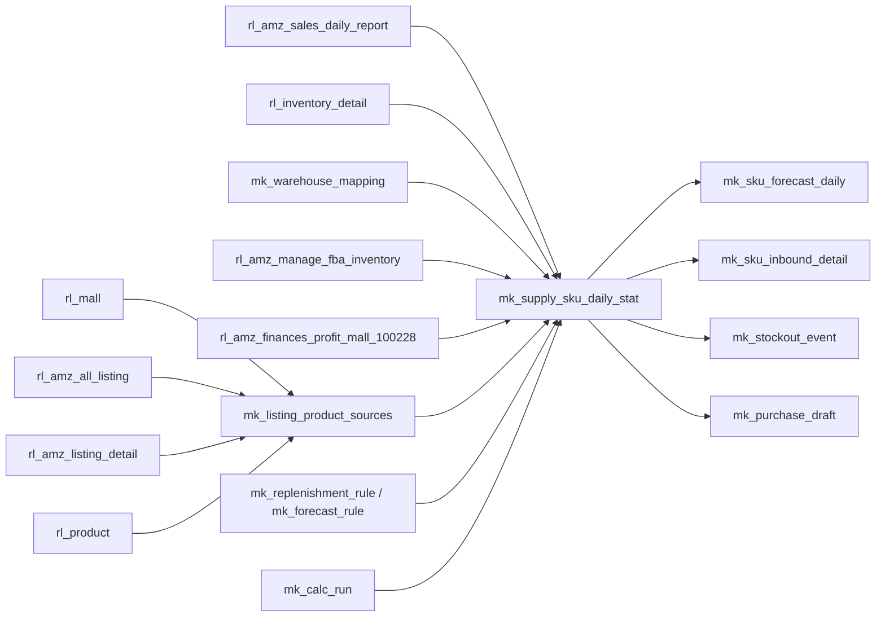

# SupplyAI 数据表设计

更新时间：2026-05-09

## 1. 命名约定

SupplyAI 项目内表名按来源区分：

| 类型 | 命名规则 | 示例 | 说明 |
|-|-|-|-|
| 真实源表 | `rl_{真实表名}` | `rl_amz_all_listing` | 采用已有真实业务表结构和数据，进入 SupplyAI 项目后统一加 `rl_` 前缀。 |
| 项目新增表 | `mk_{业务表名}` | `mk_supply_sku_daily_stat` | SupplyAI 自建、派生、mock、演示补齐、物化快照表统一加 `mk_` 前缀。 |

规则：

- 只改项目内表名，不改真实源表字段名。
- `rl_` 表表示可直接从真实系统同步或镜像的数据。
- `mk_` 表表示 SupplyAI 为计算、展示、规则、AI 解释或演示闭环新增的数据。
- 前端、接口、计算任务统一使用项目内表名，不直接暴露无前缀真实表名。

## 2. 表清单

### 2.1 真实源表映射

| 项目内表名 | 对应真实表 | 主要作用 | 关键限制 |
|-|-|-|-|
| `rl_mall` | `mall` | 店铺、国家、平台、币种、授权状态。 | 没有明确负责人字段。 |
| `rl_amz_all_listing` | `amz_all_listing` | Listing 主身份、MSKU、ASIN、标题、售价、FBA/FBM、状态。 | 项目内主键按 `listing_id`，前端按 string 处理。 |
| `rl_amz_listing_detail` | `amz_listing_detail` | 图片、品牌、分类、包装规格、首单/开售时间。 | 与 listing 通过 `listing_id` / `tenant_id + mall_id + msku` 关联。 |
| `rl_product` | `product` | ERP SKU、品名、负责人、采购员、采购交期、采购成本、物流配置。 | 与 listing 的稳定关联规则仍需生产侧确认。 |
| `rl_amz_sales_daily_report` | `amz_sales_daily_report` | 历史逐日销量、销售额、订单量。 | 历史口径不包含今天。 |
| `rl_amz_finances_profit_mall_100228` | `amz_finances_profit_mall_100228` | 店铺级广告费、仓储费、费用和利润解释。 | 店铺维度，不含 `msku`，不能直接替代 SKU 级毛利。 |
| `rl_inventory_detail` | `inventory_detail` | 本地库存明细、库存成本、归属人。 | 本地仓/FBA 仓需要仓库类型规则区分。 |
| `rl_amz_manage_fba_inventory` | `amz_manage_fba_inventory` | FBA 可售、计划入库、标发在途、入库中、预留、不可售。 | `afn_inbound_shipped_quantity` 和 `afn_inbound_receiving_quantity` 必须分开，避免重复计算。 |

### 2.2 SupplyAI 新增表

| 项目内表名 | 来源 | 主要作用 |
|-|-|-|
| `mk_tenant_config` | mock | 租户默认时区、每日推送时间、上游同步时间。 |
| `mk_warehouse_mapping` | mock，待真实源表 | 仓库 ID 到仓库类型的映射，用于识别本地仓/FBA 仓/海外仓/虚拟仓。 |
| `mk_listing_product_sources` | materialized | 汇总 listing/detail/product，形成 SupplyAI 商品主物化表。 |
| `mk_replenishment_rule` | mock / later actual | 安全天数、采购时效、规则作用范围。 |
| `mk_rule_logistics_method` | mock / later actual | 一个补货规则下的多物流方式，采购时效取最长。 |
| `mk_forecast_rule` | mock / later actual | 固定/动态/默认销量预测规则、去噪配置。 |
| `mk_calc_run` | derived | 计算批次、源数据时间、规则版本，保证同一行字段来自同一次计算。 |
| `mk_supply_sku_daily_stat` | derived | 备货计划核心快照，支撑工作台、列表、Dashboard。 |
| `mk_sku_forecast_daily` | derived + mock | 每个 MSKU 的未来逐日预测销量。 |
| `mk_sku_inbound_detail` | mock，待真实源表 | 本地采购在途、调拨在途、待加工、本地入库解释。 |
| `mk_stockout_event` | derived | 断货历史事件和 Dashboard 断货趋势。 |
| `mk_purchase_draft` | derived + mock | 生成采购计划草稿演示，不做真实采购回写。 |
| `mk_export_task` | mock / later actual | 超 5000 条异步导出任务记录。 |

## 3. 数据分层



## 4. 核心表设计

### 4.1 `mk_tenant_config`

| 字段 | 类型 | 说明 |
|-|-|-|
| `tenant_id` | BIGINT PK | 租户 ID。 |
| `tenant_name` | VARCHAR(100) | 租户名称。 |
| `timezone` | VARCHAR(50) | 默认 `Asia/Shanghai`。 |
| `daily_push_time` | TIME | 默认 `08:00:00`。 |
| `source_refresh_times_json` | JSON | 默认 `["00:30","12:00","18:00"]`。 |
| `created_at` | DATETIME | 创建时间。 |

### 4.1.1 `mk_warehouse_mapping`

仓库类型映射表。当前真实库存表 `rl_inventory_detail` 只有 `warehouse_id`，没有仓库类型字段；Phase 1 先用该表补齐映射，生产前如数据团队提供真实仓库表，则替换为 `rl_warehouse` 或 `rl_warehouse_mapping`。

| 字段 | 类型 | 说明 |
|-|-|-|
| `tenant_id` | BIGINT | 租户 ID。 |
| `warehouse_id` | BIGINT | 对应 `rl_inventory_detail.warehouse_id`。 |
| `warehouse_name` | VARCHAR(100) | 仓库名称，演示可 mock。 |
| `warehouse_type` | VARCHAR(30) | `local` / `fba_transfer` / `overseas` / `virtual` / `unknown`。 |
| `include_in_local_actual` | TINYINT | 是否计入 `local_actual`。Phase 1 仅 `local` 计入。 |
| `source_type` | VARCHAR(20) | `mock` / `actual`。 |
| `updated_at` | DATETIME | 更新时间。 |

### 4.2 `mk_listing_product_sources`

项目商品主物化表，由真实源表汇总得到。Phase 1 按每次 `mk_calc_run` 前重建或刷新，避免详情页和列表重复 join 多张真实源表。本表保留 FBA / FBM 全量商品，FBA-only 限制只发生在备货计算、风险列表和采购建议层。

| ViewModel 字段 | 来源优先级 | 说明 |
|-|-|-|
| `listing_id` | `rl_amz_all_listing.listing_id` | SKU 详情路由和接口主键，前端按 string 处理。 |
| `tenant_id` | `rl_amz_all_listing.tenant_id` | 租户过滤。 |
| `mall_id` | `rl_amz_all_listing.mall_id` | 店铺粒度。 |
| `msku` | `rl_amz_all_listing.msku` | 平台 SKU。 |
| `sku` | `rl_product.sku` | ERP SKU，关联规则待确认。 |
| `asin` / `fnsku` | `rl_amz_all_listing` | 平台商品身份。 |
| `delivery_method` | `rl_amz_all_listing.delivery_method` | 保留真实履约方式：FBA / FBM。Phase 1 备货计算和列表查询过滤 `delivery_method = 'FBA'`。 |
| `title` | `rl_amz_all_listing.item_name` | Listing 标题（亚马逊页面标题）。 |
| `product_name` | `rl_product.product_name`，缺失回退 `title` | ERP 仓库品名，列表"品名"列展示。 |
| `image_url` | `rl_amz_listing_detail.image_url`，缺失回退 `rl_product.image_url` | 图片展示。 |
| `brand` / `category` | `rl_amz_listing_detail.brand`, `display_group_title`, `classification_title` | 品牌和分类筛选。 |
| `unit_cost` | `rl_inventory_detail.unit_inventory_cost`，缺失回退 `rl_product.purchase_price` | 采购金额估算。 |
| `owner` | `rl_product.responsible_user_ids`，缺失回退 `rl_inventory_detail.owners` | 负责人展示，演示可 mock 姓名。 |

### 4.3 `mk_replenishment_rule`

| 字段 | 类型 | 说明 |
|-|-|-|
| `rule_id` | VARCHAR(64) PK | 补货规则 ID。 |
| `tenant_id` | BIGINT | 租户 ID。 |
| `scope_type` | VARCHAR(20) | `global` / `store` / `sku`。 |
| `mall_id` | BIGINT NULL | 店铺范围；全局规则为空。 |
| `msku` | VARCHAR(64) NULL | SKU 特配范围；非 SKU 规则为空。 |
| `safety_days` | INT | 安全天数。 |
| `purchase_duration_days` | INT | 采购时长。 |
| `delivery_days` | INT | 采购交期。 |
| `qc_days` | INT | 质检时长。 |
| `rule_version` | VARCHAR(30) | 规则版本，供 `mk_calc_run` 引用。 |
| `enabled` | TINYINT | 是否启用。 |
| `updated_by` | VARCHAR(50) | 最近更新人。 |
| `updated_at` | DATETIME | 最近更新时间。 |
| `source_type` | VARCHAR(20) | `mock` / `actual`。 |

约束：

```sql
CHECK (
  scope_type != 'sku'
  OR (mall_id IS NOT NULL AND msku IS NOT NULL AND msku != '')
)
```

### 4.4 `mk_rule_logistics_method`

| 字段 | 类型 | 说明 |
|-|-|-|
| `id` | BIGINT PK | 主键。 |
| `rule_id` | VARCHAR(64) | 关联 `mk_replenishment_rule.rule_id`。 |
| `logistics_mode` | VARCHAR(30) | 海运 / 空运 / 快船 / 快递。 |
| `logistics_days` | INT | 物流时效。 |
| `is_active` | TINYINT | 是否参与计算。 |
| `source_type` | VARCHAR(20) | `mock` / `actual`。 |

计算采购时效时，多个物流方式永远取最长。

### 4.5 `mk_forecast_rule`

| 字段 | 类型 | 说明 |
|-|-|-|
| `rule_id` | VARCHAR(64) PK | 预测规则 ID。 |
| `tenant_id` | BIGINT | 租户 ID。 |
| `scope_type` | VARCHAR(20) | `global` / `store` / `sku`。 |
| `mall_id` | BIGINT NULL | 店铺范围。 |
| `msku` | VARCHAR(64) NULL | SKU 范围。 |
| `forecast_mode` | VARCHAR(20) | `fixed` / `dynamic` / `default`。 |
| `fixed_daily_sales` | DECIMAL(10,2) | 固定日销量。 |
| `default_daily_sales` | DECIMAL(10,2) | 默认未来日销量。 |
| `weight_3d` / `weight_7d` / `weight_15d` / `weight_30d` | INT | 动态销量权重。 |
| `denoise_enabled` | TINYINT | 是否开启去噪。 |
| `abnormal_dates_json` | JSON | 异常时间段。 |
| `abnormal_sales_rule_json` | JSON | 异常销量规则。 |
| `allow_empty_rule` | TINYINT | 允许空规则。 |
| `updated_by` | VARCHAR(50) | 最近更新人。 |
| `updated_at` | DATETIME | 最近更新时间。 |
| `source_type` | VARCHAR(20) | `mock` / `actual`。 |

批量预测保存每个 MSKU 的预测数据，动态规则按同一组权重套用到各自历史数据。

### 4.6 `mk_calc_run`

| 字段 | 类型 | 说明 |
|-|-|-|
| `calc_run_id` | VARCHAR(64) PK | 计算批次 ID。 |
| `tenant_id` | BIGINT | 租户 ID。 |
| `stat_date` | DATE | 统计日期。 |
| `run_type` | VARCHAR(20) | `scheduled` / `rule_changed` / `manual`。 |
| `run_at` | DATETIME | 计算发生时间。 |
| `source_sales_at` | DATETIME | 销量源数据时间。 |
| `source_inventory_at` | DATETIME | 库存源数据时间。 |
| `source_inbound_at` | DATETIME | 在途源数据时间。 |
| `rule_version` | VARCHAR(30) | 规则版本。 |
| `status` | VARCHAR(20) | `success` / `running` / `failed`。 |
| `error_message` | VARCHAR(500) NULL | 生产建议补充。 |
| `source_type` | VARCHAR(20) | `derived` / `mock`。 |

### 4.7 `mk_supply_sku_daily_stat`

备货计划核心结果快照表。列表和 Dashboard 优先读这张表，不建议每次实时聚合所有明细。

| 字段 | 类型 | 说明 |
|-|-|-|
| `id` | BIGINT PK | 主键。 |
| `calc_run_id` | VARCHAR(64) | 关联 `mk_calc_run`。 |
| `tenant_id` | BIGINT | 租户 ID。 |
| `stat_date` | DATE | 统计日期。 |
| `listing_id` | BIGINT | 来源 `rl_amz_all_listing.listing_id`。 |
| `mall_id` | BIGINT | 店铺。 |
| `country_code` | VARCHAR(10) | 国家简码。 |
| `msku` | VARCHAR(64) | MSKU。 |
| `fnsku` | VARCHAR(64) | FNSKU。 |
| `sku` | VARCHAR(64) | ERP SKU。 |
| `asin` | VARCHAR(16) | ASIN。 |
| `product_name` | VARCHAR(200) | 品名。 |
| `listing_status` | VARCHAR(20) | Listing 状态。 |
| `delivery_method` | VARCHAR(20) | 履约方式；Phase 1 只纳入 `FBA`，FBM 不进备货计划列表和风险计算。 |
| `risk_level` | VARCHAR(10) | `p1` / `p2` / `p3` / `safe`（全小写存储），由 FBA 可售天数派生。前端展示时再做大小写或图标映射。 |
| `yesterday_sales` | INT | 昨日销量，来自 `rl_amz_sales_daily_report`。 |
| `yesterday_revenue` | DECIMAL(12,2) | 昨日收入。 |
| `revenue_7d` | DECIMAL(12,2) | 近 7 天收入。 |
| `expense_7d` | DECIMAL(12,2) | 近 7 天支出。 |
| `cost_7d` | DECIMAL(12,2) | 近 7 天成本。 |
| `gross_profit_7d` | DECIMAL(12,2) | 近 7 天毛利润。 |
| `gross_margin` | DECIMAL(5,4) | 毛利率。 |
| `financial_estimate_type` | VARCHAR(20) | `allocated` / `actual` / `hidden`；Phase 1 SKU 级财务为店铺级分摊估算。 |
| `sales_7d` / `sales_30d` / `sales_60d` / `sales_90d` | INT | 历史销量窗口。 |
| `forecast_daily` | DECIMAL(10,2) | 最终未来平均日销。 |
| `forecast_source` | VARCHAR(30) | `fixed` / `dynamic` / `default` / `denoised` / `raw`。 |
| `coverage_demand` | DECIMAL(12,2) | 覆盖周期需求量。 |
| `last_7d_raw_daily` | DECIMAL(10,2) | 近 7 天原始平均日销。 |
| `last_7d_denoised_daily` | DECIMAL(10,2) | 近 7 天去噪后平均日销。 |
| `fba_available` | INT | FBA 可售，来自 `rl_amz_manage_fba_inventory.afn_fulfillable_quantity`。 |
| `fba_inbound_working` | INT | FBA 计划入库，来自 `afn_inbound_working_quantity`。 |
| `fba_inbound_shipped` | INT | FBA 在途，来自 `afn_inbound_shipped_quantity`。 |
| `fba_inbound_receiving` | INT | FBA 入库中，来自 `afn_inbound_receiving_quantity`。 |
| `fba_reserved` | INT | FBA 预留，来自 `reserved_qty`。**仅展示用**（库存构成 hover / AI 解释），不参与 `total_stock` 与 `fba_sellable_days` 计算。 |
| `local_actual` | INT | 本地实际库存，来自 `rl_inventory_detail` + `mk_warehouse_mapping` 聚合。 |
| `local_plan` | INT | 本地未来可用增量，演示期由补齐表派生；不包含 `local_actual`。 |
| `total_stock` | INT | 补货覆盖口径总库存，不含 `fba_reserved`。 |
| `sellable_days` | DECIMAL(10,2) | `total_stock` 可售天数，主表展示口径。 |
| `fba_sellable_days` | DECIMAL(10,2) | FBA 侧可售天数，用于风险和预计断货。 |
| `local_sellable_days` | DECIMAL(10,2) | 本地可售天数。 |
| `safety_days` | INT | 安全天数。 |
| `stockout_date` | DATE | 预计断货时间，只取 FBA 侧口径。 |
| `lead_time_days` | INT | 全链路采购时效。 |
| `suggest_purchase` | TINYINT | 是否建议采购。 |
| `suggest_qty` | INT | 建议采购量。 |
| `suggest_purchase_date` | DATE | 建议采购时间，采用全链路口径。 |
| `unit_cost` | DECIMAL(24,4) | 采购/库存成本单价。 |
| `currency` | VARCHAR(10) | 金额币种。 |
| `base_currency` | VARCHAR(10) | 租户基准币种；Phase 1 默认 `USD`。 |
| `fx_rate_to_base` | DECIMAL(18,8) | `currency` 到 `base_currency` 的汇率；Phase 1 可固定为 `1.0`。 |
| `fx_rate_as_of` | DATETIME | 汇率时间点。 |
| `suggest_amount` | DECIMAL(14,2) | 原币种预计采购金额：`suggest_qty * unit_cost`。 |
| `suggest_amount_base` | DECIMAL(14,2) | 基准币种预计采购金额：`suggest_amount * fx_rate_to_base`。 |
| `updated_at` | DATETIME | 最后更新时间。 |
| `source_type` | VARCHAR(20) | `derived` / `mock`。 |

关键公式：

```text
coverage_demand = forecast_daily * (lead_time_days + safety_days)
total_stock = fba_available
            + fba_inbound_working
            + fba_inbound_shipped
            + fba_inbound_receiving
            + local_actual
            + local_plan
suggest_qty = CEIL(max(0, coverage_demand - total_stock))
sellable_days = total_stock / forecast_daily
fba_sellable_days = (fba_available
                   + fba_inbound_working
                   + fba_inbound_shipped
                   + fba_inbound_receiving) / forecast_daily
stockout_date = today + fba_sellable_days
suggest_purchase_date = stockout_date - lead_time_days
```

库存口径决策：

- `fba_inbound_working` 计入 FBA 侧可售天数和总库存，因为它代表已创建 FBA 入库计划的库存；如本地仓仍保留同一批货，需要通过本地库存锁定/仓库映射避免双算。
- `fba_reserved` 不计入 `fba_sellable_days` 和 `total_stock`，因为预留库存已经被买家订单、运营中心转运或处理流程锁定，不能覆盖未来需求。
- `local_actual = SUM(available_quantity + available_locked_quantity + defective_quantity + defective_locked_quantity)`，仅统计 `mk_warehouse_mapping.include_in_local_actual = 1` 的本地仓。真实表暂缺待检量、待上架量，生产前需要补来源。
- `local_plan` 只表示本地未来可用增量，不包含 `local_actual`。Phase 1 演示期派生公式：

  ```text
  local_plan = SUM(qty FROM mk_sku_inbound_detail
              WHERE tenant_id + mall_id + msku 匹配
                AND inbound_type IN ('purchase', 'transfer', 'processing', 'local_receiving')
                AND inbound_status IN ('in_transit', 'pending', 'receiving'))
  ```

  如果上游未来提供"本地预计总量"，入库前先转换为 `local_plan = local_expected_total - local_actual`，避免和 `local_actual` 双算。
- `suggest_qty` 一律向上取整，避免 `0.4` 件被四舍五入为 `0` 导致漏补。

### 4.8 `mk_sku_forecast_daily`

| 字段 | 类型 | 说明 |
|-|-|-|
| `calc_run_id` | VARCHAR(64) | 计算批次。 |
| `tenant_id` | BIGINT | 租户 ID。 |
| `mall_id` | BIGINT | 店铺。 |
| `msku` | VARCHAR(64) | MSKU。 |
| `forecast_date` | DATE | 预测日期，未来口径包含今天。 |
| `day_offset` | INT | 相对今天的天数。 |
| `forecast_qty` | DECIMAL(10,2) | 预测销量；参与后续计算时保留小数。 |
| `forecast_source` | VARCHAR(30) | 预测来源。 |
| `sales_multiplier` | DECIMAL(8,4) | 交互调整系数，默认 1。 |
| `is_adjusted` | TINYINT | 是否被用户调整。 |
| `source_type` | VARCHAR(20) | `derived` / `mock`。 |

一致性要求：

- `mk_supply_sku_daily_stat.forecast_daily` 与 `mk_sku_forecast_daily` 必须来自同一个 `calc_run_id`。
- 计算任务在同一事务内写入快照和逐日预测；如果事务能力不足，先写临时批次，完成校验后再把 `mk_calc_run.status` 置为 `success`。
- `forecast_daily` 为逐日预测在配置预测窗口内的均值物化值，允许小数误差不超过 `0.01`；页面/API 不再各自实时重算。

### 4.9 `mk_sku_inbound_detail`

FBA 平台侧 working / shipped / receiving 已由 `rl_amz_manage_fba_inventory` 支撑。本表只保留采购在途、调拨在途、待加工、本地入库解释等暂未拿到真实来源的数据。

| 字段 | 类型 | 说明 |
|-|-|-|
| `inbound_id` | VARCHAR(64) PK | 在途单据 ID。 |
| `tenant_id` | BIGINT | 租户 ID。 |
| `mall_id` | BIGINT | 店铺。 |
| `msku` | VARCHAR(64) | MSKU。 |
| `sku` | VARCHAR(64) | ERP SKU。 |
| `inbound_type` | VARCHAR(30) | `purchase` / `transfer` / `local_receiving` / `processing`。 |
| `inbound_status` | VARCHAR(30) | `in_transit` / `receiving` / `pending`。 |
| `qty` | INT | 数量。 |
| `expected_arrival_date` | DATE | 预计到货日期。 |
| `source_order_no` | VARCHAR(64) | 模拟采购单/调拨单号。 |
| `source_type` | VARCHAR(20) | `mock`。 |

### 4.10 `mk_stockout_event`

| 字段 | 类型 | 说明 |
|-|-|-|
| `event_id` | VARCHAR(64) PK | 事件 ID。 |
| `tenant_id` | BIGINT | 租户 ID。 |
| `mall_id` | BIGINT | 店铺。 |
| `msku` | VARCHAR(64) | MSKU。 |
| `start_at` | DATETIME | 断货开始时间。 |
| `end_at` | DATETIME NULL | 恢复时间。 |
| `duration_days` | DECIMAL(10,2) | 断货持续天数。 |
| `event_status` | VARCHAR(20) | `open` / `closed`。 |
| `source_type` | VARCHAR(20) | `derived` / `mock`。 |

### 4.11 `mk_purchase_draft`

| 字段 | 类型 | 说明 |
|-|-|-|
| `draft_id` | VARCHAR(64) PK | 草稿 ID。 |
| `calc_run_id` | VARCHAR(64) | 关联计算批次。 |
| `tenant_id` | BIGINT | 租户 ID。 |
| `mall_id` | BIGINT | 店铺。 |
| `msku` | VARCHAR(64) | MSKU。 |
| `sku` | VARCHAR(64) | ERP SKU。 |
| `suggest_qty` | INT | 建议采购量。 |
| `supplier_name` | VARCHAR(100) | 供应商名称，mock。 |
| `status` | VARCHAR(20) | `draft` / `confirmed` / `redirected`。 |
| `created_by` | VARCHAR(50) | 创建人。 |
| `created_at` | DATETIME | 创建时间。 |
| `source_type` | VARCHAR(20) | `mock`。 |

命名说明：表名不带 `_mock` 后缀。Phase 1 可通过 `source_type = mock` 标记演示数据，后续生产化时不需要再改表名。

### 4.12 `mk_export_task`

| 字段 | 类型 | 说明 |
|-|-|-|
| `task_id` | VARCHAR(64) PK | 导出任务 ID。 |
| `tenant_id` | BIGINT | 租户 ID。 |
| `created_by` | VARCHAR(50) | 发起人。 |
| `scope_json` | JSON | 导出筛选条件、排序、列配置。 |
| `row_count` | INT | 预计导出行数。 |
| `status` | VARCHAR(20) | `pending` / `running` / `success` / `failed` / `expired`。 |
| `file_url` | VARCHAR(500) | 下载地址。 |
| `expires_at` | DATETIME | 下载有效期。 |
| `error_message` | VARCHAR(500) | 失败原因。 |
| `created_at` / `updated_at` | DATETIME | 创建和更新时间。 |

## 5. 真实源表关键字段

### 5.1 `rl_amz_sales_daily_report`

| 字段 | 用途 |
|-|-|
| `tenant_id`, `mall_id`, `msku` | SKU 粒度关联。 |
| `year_month_day` | 历史销量日期，计算时 cast 为 DATE。 |
| `sales_volume` | 当日销量。 |
| `sales` | 当日销售额。 |
| `order_quantity` | 当日订单量。 |
| `currency_code` | 销售额币种。 |

### 5.2 `rl_amz_manage_fba_inventory`

| 字段 | SupplyAI 口径 |
|-|-|
| `afn_fulfillable_quantity` | FBA 可售库存。 |
| `afn_inbound_working_quantity` | 计划入库。 |
| `afn_inbound_shipped_quantity` | FBA 标发在途。 |
| `afn_inbound_receiving_quantity` | FBA 入库中。 |
| `reserved_qty` | FBA 预留总数。 |
| `reserved_customerorders` | 买家订单预留。 |
| `reserved_fc_transfers` | 运营中心转运预留。 |
| `reserved_fc_processing` | 运营中心处理中预留。 |
| `afn_unsellable_quantity` | FBA 不可售。 |
| `afn_total_quantity` | FBA 总量，注意已包含 working / shipped / receiving。 |

### 5.3 `rl_amz_finances_profit_mall_100228`

| 字段组 | 字段 | 用途 |
|-|-|-|
| 广告费 | `sp_ads_fee`, `sb_ads_fee`, `sbv_ads_fee`, `sd_ads_fee`, `ads_fee_share`, `product_ads_payment` | Dashboard 店铺级费用、AI 解释广告费变化。 |
| 仓储费 | `month_storage_fee`, `permanent_storage_fee`, `excess_storage_fee`, `fba_storage_fee`, `fba_long_storage_fee` | 滞销、库龄、库存成本解释。 |
| 销售额 | `fba_sales`, `fbm_sales` | 店铺维度销售额校验。 |
| 费用 | `commission`, `fba_commission`, `fbm_commission`, `fba_shipment_fee` | 店铺级费用解释。 |

边界：该表是店铺维度，唯一键为 `tenant_id + settlement_date + mall_id`，不能直接给 SKU 级毛利做精确来源。

### 5.4 SKU 级财务分摊口径

Phase 1 如果页面需要展示 SKU 级 `expense_7d`、`gross_profit_7d`、`gross_margin`，只能基于店铺维度利润表做估算分摊。

```text
sku_revenue_7d = SUM(rl_amz_sales_daily_report.sales) by tenant_id + mall_id + msku
mall_revenue_7d = SUM(sku_revenue_7d) by tenant_id + mall_id
sku_ratio = sku_revenue_7d / mall_revenue_7d
sku_expense_7d = mall_expense_7d * sku_ratio
gross_profit_7d = revenue_7d - cost_7d - sku_expense_7d
gross_margin = gross_profit_7d / revenue_7d
```

约束：

- `financial_estimate_type = 'allocated'` 时，SKU 级财务字段是分摊估算，不是真实 SKU 级利润。
- 低销量 SKU 的分摊误差会较大；正式上线如需准确毛利，需要补 SKU 级利润表或费用分摊服务。
- 如果产品不接受估算，Phase 1 SKU 详情隐藏毛利相关字段，只在 Dashboard 展示店铺级费用/利润。

### 5.5 `rl_inventory_detail` 字段兼容性

真实表中存在大小写不规范字段，例如 `Inventory_value`、`mall_Identify_code`。MySQL 在不同 `lower_case_table_names` 配置下大小写敏感性不同，ORM 映射也容易出错。

处理要求：

- `rl_*` 层保留真实字段名。
- API DTO / ViewModel 层统一转为稳定小写驼峰或 snake_case，例如 `inventory_value`、`mall_identify_code`。
- SQL 查询必须显式列名，不使用 `SELECT *` 直接透传到前端。

## 6. 页面与数据表映射

| 页面/能力 | 主表 | 辅助表 |
|-|-|-|
| 全局 Dashboard | `mk_supply_sku_daily_stat` | `rl_mall`, `rl_amz_sales_daily_report`, `rl_amz_finances_profit_mall_100228`, `rl_amz_manage_fba_inventory`, `mk_stockout_event` |
| 备货计划列表 | `mk_supply_sku_daily_stat` | `mk_listing_product_sources`, `rl_mall`, `rl_amz_manage_fba_inventory` |
| SKU 分析详情 | `mk_listing_product_sources`, `mk_supply_sku_daily_stat` | `rl_amz_sales_daily_report`, `mk_sku_forecast_daily`, `rl_inventory_detail`, `mk_warehouse_mapping`, `rl_amz_manage_fba_inventory`, `mk_sku_inbound_detail` |
| 规则设置 | `mk_replenishment_rule`, `mk_forecast_rule` | `mk_rule_logistics_method` |
| 全局 AI | `mk_supply_sku_daily_stat` | `mk_calc_run`, `mk_listing_product_sources`, 真实源表 |
| SKU AI | `mk_supply_sku_daily_stat` | `mk_calc_run`, `mk_replenishment_rule`, `mk_forecast_rule`, 真实源表与动态明细表 |
| 生成采购计划 | `mk_purchase_draft` | `mk_supply_sku_daily_stat`, `mk_listing_product_sources` |

## 7. 建议索引与唯一约束

| 表 | 唯一键 / 索引建议 |
|-|-|
| `rl_mall` | 主键 `mall_id`；唯一键 `tenant_id + seller_id + marketplace_id`。 |
| `rl_amz_all_listing` | 主键 `listing_id`；唯一键 `tenant_id + msku + mall_id`。 |
| `rl_amz_listing_detail` | 主键 `listing_detail_id`；唯一键 `tenant_id + mall_id + msku`。 |
| `rl_product` | 主键 `product_id`；唯一键 `del_flag + sku + tenant_id`。 |
| `rl_amz_sales_daily_report` | 主键 `id`；唯一键 `tenant_id + year_month_day + mall_id + msku`。 |
| `rl_amz_finances_profit_mall_100228` | 主键 `id`；唯一键 `tenant_id + settlement_date + mall_id`。 |
| `rl_inventory_detail` | 主键 `detail_id`；建议索引 `tenant_id + mall_id + msku`、`sku + tenant_id + warehouse_id`。 |
| `rl_amz_manage_fba_inventory` | 主键 `manage_inventory_id`；唯一键 `tenant_id + mall_id + msku`。 |
| `mk_warehouse_mapping` | 唯一键 `tenant_id + warehouse_id`；索引 `warehouse_type`、`include_in_local_actual`。 |
| `mk_supply_sku_daily_stat` | 唯一键 `calc_run_id + tenant_id + mall_id + msku`；索引 `risk_level`、`stockout_date`、`suggest_purchase`。 |
| `mk_sku_forecast_daily` | 唯一键 `calc_run_id + tenant_id + mall_id + msku + forecast_date`。 |
| `mk_sku_inbound_detail` | 索引 `tenant_id + mall_id + msku`、`expected_arrival_date`。 |
| `mk_replenishment_rule` | 索引 `tenant_id + scope_type + mall_id + msku`。 |
| `mk_forecast_rule` | 索引 `tenant_id + scope_type + mall_id + msku`。 |

## 8. 最小落地顺序

1. 同步真实源表为 `rl_*`：`rl_mall`、`rl_amz_all_listing`、`rl_amz_listing_detail`、`rl_product`、`rl_amz_sales_daily_report`、`rl_amz_finances_profit_mall_100228`、`rl_inventory_detail`、`rl_amz_manage_fba_inventory`。
2. 建 `mk_tenant_config` 和 `mk_warehouse_mapping`，写入默认时区、推送时间、上游刷新时间和仓库类型映射。
3. 基于真实源表生成 `mk_listing_product_sources`，保留 FBA / FBM 全量商品；生成 `mk_supply_sku_daily_stat` 时仅取 `delivery_method = 'FBA'` 的商品进入备货计算。
4. 生成规则表：`mk_replenishment_rule`、`mk_rule_logistics_method`、`mk_forecast_rule`。
5. 生成 `mk_calc_run`、`mk_supply_sku_daily_stat` 和 `mk_sku_forecast_daily`；同一 `calc_run_id` 内快照和逐日预测必须事务一致。
6. 生成 `mk_sku_inbound_detail`、`mk_stockout_event`。
7. 生成 `mk_purchase_draft` 和 `mk_export_task`，用于演示动作闭环。

## 9. 仍需补齐或确认的数据

| 缺口 | 当前处理 | 影响 |
|-|-|-|
| 规则配置真实来源 | 先用 `mk_replenishment_rule` / `mk_forecast_rule` mock | 后续接生产配置表时替换。 |
| 本地采购在途、调拨在途、待加工 | 先用 `mk_sku_inbound_detail` 补齐 | 影响总库存、全链路建议采购时间解释。 |
| SKU 级精确利润 | 店铺级用 `rl_amz_finances_profit_mall_100228`，SKU 级暂用销售额占比分摊，并标记 `financial_estimate_type = 'allocated'` | SKU 毛利精确度有限。 |
| 仓库类型真实来源 | Phase 1 用 `mk_warehouse_mapping`；生产前需要补 `rl_warehouse` 或真实仓库类型映射 | 影响 `local_actual` 计算准确性。 |
| `rl_product` 与 listing 稳定关联 | 暂按 `sku/msku/mall_id/product_id` 辅助关联 | 生产前需确认标准关系表或关联规则。 |
| 上次采购时间、上次发货时间 | 当前无真实来源 | 影响 AI 解释和详情展示。 |
| FBM 商品备货 | `mk_listing_product_sources` 保留 FBM；Phase 1 生成 `mk_supply_sku_daily_stat` 时过滤 `delivery_method = 'FBA'` | FBM 商品可被详情基础数据查询命中，但不进入备货列表、风险和采购建议。 |
| 多币种汇率 | Phase 1 默认租户基准币种 `USD`，汇率可固定 `1.0`；生产前补汇率服务 | 跨币种 Dashboard 金额合计仅作演示。 |

## 10. 断货事件生成规则

Phase 1 按每日计算批次生成 `mk_stockout_event`：

| 场景 | 规则 |
|-|-|
| 打开事件 | 同一 `tenant_id + mall_id + msku` 在当前成功 `calc_run_id` 中 `fba_available <= 0`，且不存在 open 事件。 |
| 保持事件 | 当前仍 `fba_available <= 0`，保留原 `start_at`，更新持续天数。 |
| 关闭事件 | 当前 `fba_available > 0`，关闭 open 事件，写入 `end_at`。 |
| 事件粒度 | Phase 1 按日粒度，不设置最小持续时长。 |

说明：断货事件使用 FBA 仓内可售为触发条件，不把 FBA 在途计入“当前是否断货”；在途只影响预计断货时间和风险等级。

## 10.5 本地 SQLite 兼容性（Phase 2-3 开发期）

> 配套决策见 [`supplyai-decisions.md` DB-001 / DB-003](./supplyai-decisions.md)。本地开发使用 SQLite 替代 MySQL，由 SQLAlchemy ORM 抽象层处理差异。生产仍是 MySQL 8.0+。

| 真实表特性 | SQLite 处理 | 应用层影响 |
|-|-|-|
| `utf8mb4_0900_bin`（msku 字段，区分大小写） | SQLAlchemy 用 `String(50, collation='BINARY')`；SQLite 默认即区分大小写 | 0 影响 |
| `utf8mb4_0900_ai_ci` 不区分大小写 | SQLite 默认 `NOCASE` collation 等价 | 0 影响 |
| `Inventory_value` / `mall_Identify_code` 大写字段名 | SQLAlchemy `mapped_column("Inventory_value", ...)` 显式映射 | 0 影响 |
| `JSON` 字段（`product_logistics_list` / `abnormal_dates_json`） | SQLite 3.45+ JSON1 模块原生支持；SQLAlchemy `JSON` 类型自动适配 | 0 影响（查询时 JSON 函数语法略不同，由 SQLAlchemy 抽象） |
| `DECIMAL(24,4)` | SQLite 不严格 DECIMAL，存为 NUMERIC | Python 端用 `Decimal` 处理，精度足够 |
| `BIGINT AUTO_INCREMENT` | SQLite `INTEGER PRIMARY KEY AUTOINCREMENT` 自动适配 | 0 影响 |
| `CHECK` 约束（特配规则 mall_id NOT NULL） | SQLite 原生支持 | 0 影响 |
| 高并发写入 | SQLite 单写入瓶颈 | 本地开发不触发；演示 / 生产用 MySQL |
| 真实表 DDL 直接 import | 不可——SQLite 不识别 MySQL 特定语法 | rl_* 表通过 SQLAlchemy ORM 自动建表（Alembic migration），不直接 import 真实 MySQL DDL |

**rl_* 数据进 SupplyAI 本地 DB 的方式**：

| 阶段 | 方式 | 脚本 |
|---|---|---|
| Phase 2 演示数据 | 用 Faker / 业务规则生成 | `scripts/seed.py` |
| Phase 3 接近真实 | 从生产 MySQL 导出 dump，翻译 schema 后插入 SQLite | `scripts/import_dump.py` |
| Phase 4-5 生产 | Celery ETL 拉 Amazon SP-API + 上游业务系统 | `tasks/etl/*.py` |

**切到生产 MySQL 时**：业务代码、ORM 模型、API 全部 0 修改；只需 `.env` 改 `DATABASE_URL=mysql+aiomysql://...`，Alembic 在新库重跑 migration 即可。

## 11. Phase 1 前置确认清单

| 优先级 | 问题 | 当前建议 |
|-|-|-|
| P0 | 是否能提供真实仓库表或仓库类型映射？ | 若不能，Phase 1 用 `mk_warehouse_mapping` mock，但生产前必须替换为真实来源。 |
| P1 | SKU 级毛利是否允许展示分摊估算？ | 允许则用 `financial_estimate_type = 'allocated'`；不允许则 SKU 详情隐藏毛利。 |
| P1 | FBM 是否进入本期备货计算？ | 建议基础表保留 FBM，Phase 1 备货计算只支持 FBA。 |
| P1 | Dashboard 多币种金额是否需要真实折算？ | 演示可固定 USD + 1.0 汇率；生产前补汇率服务。 |
