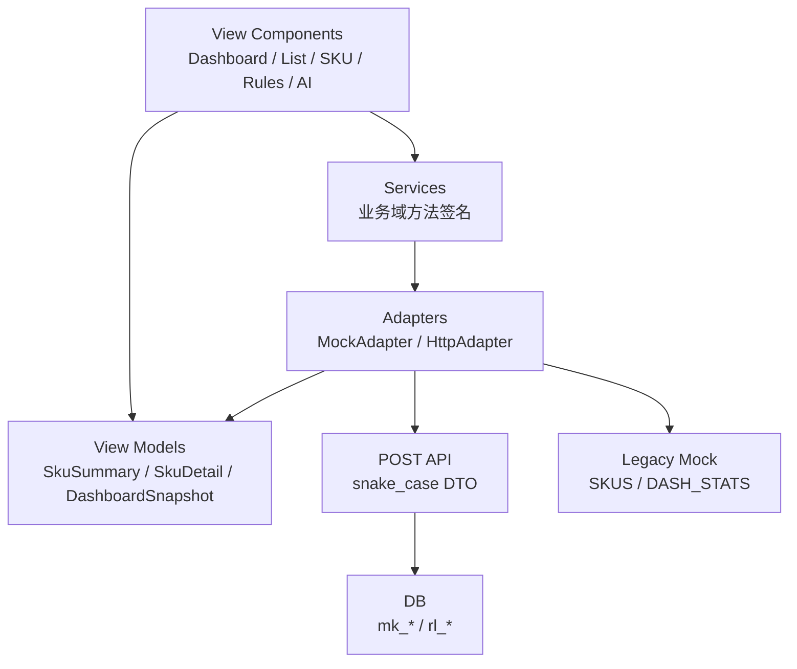

# SupplyAI 前端数据层隔离技术方案

来源：飞书《SupplyAI 前端数据层隔离技术方案》revision 6，本地按 2026-05-09 最新数据表设计修订。

相关文档：

- [SupplyAI 数据表设计](./supplyai-data-table-design.md)
- [SupplyAI 字段映射表 v2](./supplyai-field-mapping-v2.md)
- [SupplyAI 决策日志](./supplyai-decisions.md)

## 1. 目标

当前演示系统的 UI 组件仍大量依赖 `data.jsx` 中的全局 mock 数据，例如 `SKUS`、`DASH_STATS`、`TODAY_ACTIONS`。接入真实后端前，需要把数据访问切成稳定分层，让组件不感知 mock、HTTP、DB 字段差异。

目标：

- 组件只消费 ViewModel，不读原始 DB 字段和 mock 全局变量。
- mock 数据与真实 API 走同一套 `Services` 方法签名。
- 后端返回 snake_case DTO，前端 Adapter 统一转成 camelCase ViewModel。
- 核心补货结论以 `calc_run_id` 保证同批次一致。
- 模式可通过 URL / localStorage / feature flag 切换，支持演示模式和真实接口模式共存。

## 2. 分层架构



边界规则：

- UI 组件不得直接访问 `SKUS`、`DASH_STATS`、`TODAY_ACTIONS`。
- UI 组件不得出现 DB 表名或 DB 字段名。
- 所有页面数据读取必须从 `Services.<domain>.<method>()` 进入。
- `rl_*` 是真实源表映射层，`mk_*` 是 SupplyAI 计算/规则/快照/动作层；前端只通过 API DTO 间接访问。

## 3. 目标文件结构

```text
SupplyAI/
  data.jsx                       # legacy mock 数据，Phase 1 保留
  view-models.jsx                # ViewModel 构造、zod schema、展示默认值
  services.jsx                   # Services 门面
  adapters/
    mock-adapter.jsx             # legacy mock -> ViewModel
    http-adapter.jsx             # REST DTO -> ViewModel
    dto-mappers.jsx              # snake_case DTO 到 ViewModel 的纯函数
  config.jsx                     # 数据模式、API baseUrl、feature flags
  tests/
    adapter-contract.test.jsx    # Mock / HTTP adapter shape 合约测试
  dashboard.jsx                  # 只调用 Services.dashboard.*
  list.jsx                       # 只调用 Services.sku.*
  sku.jsx                        # 只调用 Services.sku.*
  rules.jsx                      # 只调用 Services.rule.*
  ai.jsx                         # 只调用 Services.ai.*
```

Phase 1 可以不立刻拆目录，也可以先以平铺文件实现；关键是接口边界先稳定。

### 3.1 现有代码改造影响清单

| 文件 | 改造类型 | 目标 |
|-|-|-|
| `data.jsx` | 重命名或拆分 | 保留为 `mock-data.jsx` 数据源；Phase 1 可保留旧全局变量兼容，但新组件不得继续直接依赖。 |
| `view-models.jsx` | 新增 | 定义 ViewModel 构造函数、zod schema、展示层默认值和枚举映射。 |
| `services.jsx` | 新增 | 暴露 `Services.*` 统一入口，屏蔽 mock / HTTP 差异。 |
| `adapters/mock-adapter.jsx` | 新增 | 将现有 mock 数据转成正式 ViewModel，并模拟异步、空态、错误态。 |
| `adapters/http-adapter.jsx` | 新增 | 调用 `/api/supplyai/*`，保留 snake_case DTO，再交给 mapper。 |
| `adapters/dto-mappers.jsx` | 新增 | 单点维护 DTO -> ViewModel 字段转换，避免组件内散落字段名。 |
| `config.jsx` | 新增 | 管理 `mode=mock|http`、`baseUrl`、feature flags、localStorage 持久化。 |
| `dashboard.jsx` | 修改 | 替换 `DASH_STATS` / `TODAY_ACTIONS` 直读为 `Services.dashboard.*`。 |
| `list.jsx` | 修改 | 替换 `SKUS` 直读、筛选、排序为 `Services.sku.list()` 和 ViewModel 字段。 |
| `sku.jsx` | 修改 | 替换详情 mock 拼装为 `Services.sku.detail()` / `Services.sku.trends()`。 |
| `ai.jsx` | 修改 | AI 面板走 `Services.ai.ask()`，消费 `AiAnswer.status` 和工具结果。 |
| `rules.jsx` | 修改 | 规则读取与保存走 `Services.rule.getEffective()` / `Services.rule.save()`。 |
| `app.jsx` / 路由入口 | 修改 | SKU 路由主键改为 `listing_id`，兼容现有 `page` / `v` 参数。 |

## 4. ViewModel 契约

字段映射以 [SupplyAI 字段映射表 v2](./supplyai-field-mapping-v2.md) 为准。

运行时校验决策：

- 使用 `zod` 定义 DTO 和 ViewModel schema，每个核心 ViewModel 一份 schema，集中放在 `view-models.jsx` 或后续拆出的 `schemas/`。
- `dto-mappers.jsx` 负责 snake_case DTO -> camelCase ViewModel，mapper 输出必须通过对应 ViewModel schema。
- zod 校验失败不在组件内吞掉；Adapter 需要把可降级缺失写入 `dataQuality`，结构性错误进入错误态。
- 这不是 TypeScript 迁移方案；当前 HTML / Babel 形态下仍可通过运行时 schema 保证 mock 与 HTTP 输出一致。

核心 ViewModel：

| ViewModel | 用途 | 主来源 |
|-|-|-|
| `SkuSummary` | 备货列表、风险队列、Dashboard SKU 摘要 | `mk_supply_sku_daily_stat` + `mk_listing_product_sources` |
| `StockBreakdown` | 库存构成 hover、详情卡、AI 解释 | `mk_supply_sku_daily_stat` |
| `SkuDetail` | SKU 详情页完整数据 | `SkuSummary` + 趋势 + 规则 + 在途 |
| `SalesTrendPoint` | 历史销量趋势 | `rl_amz_sales_daily_report` |
| `ForecastTrendPoint` | 未来预测趋势 | `mk_sku_forecast_daily` |
| `DashboardSnapshot` | 工作台聚合 | `mk_supply_sku_daily_stat` + `mk_stockout_event` + 财务源表 |
| `RuleConfig` | 补货 / 预测规则配置 | `mk_replenishment_rule` + `mk_forecast_rule` |
| `AiAnswer` | AI 回答 | 后端 AI 服务 + 当前快照 |
| `PurchaseDraft` | 采购草稿 | `mk_purchase_draft` |
| `ExportTask` | 异步导出任务 | `mk_export_task` |

关键枚举：

| 字段 | 存储值 | ViewModel | 展示 |
|-|-|-|-|
| 风险等级 | `p1` / `p2` / `p3` / `safe` | `priority` | P1 / P2 / P3 / 安全 |
| 履约方式 | `FBA` / `FBM` | `deliveryMethod` | FBA / FBM |
| 财务估算 | `allocated` / `actual` / `hidden` | `financialEstimateType` | 分摊估算 / 真实 / 隐藏 |

关键辅助结构：

```js
const DataQuality = {
  missingFields: [], // string[]
  warnings: [],      // { code, field, message, severity }[]
};

const SuggestTotalAmount = {
  base: { amount: 0, currency: 'USD' },
  byCurrency: [], // [{ currency, amount }]
  fxRateAsOf: null,
};
```

字段取舍：

- `localTotal` 不再作为 ViewModel 字段输出，避免和 `totalStock` 以及本地预计总量混淆。
- 本地库存使用 `StockBreakdown.localActual` 和 `StockBreakdown.localPlan`；如果页面需要本地预计总量，由展示层计算 `localActual + localPlan`。
- Dashboard 采购金额使用 `suggestTotalAmount = { base, byCurrency, fxRateAsOf }`，其中 `base` 对应租户基准币种折算值，`byCurrency` 用于 hover 明细。

## 5. Services 方法签名

所有方法返回 `Promise`，mock 也必须异步化，避免组件以后从同步改异步。

```js
const Services = {
  calc: {
    latest: () => Promise<CalcRun>,
    status: (calcRunId) => Promise<CalcRunStatus>,
  },
  dashboard: {
    snapshot: (params) => Promise<DashboardSnapshot>,
    riskQueue: (params) => Promise<SkuSummary[]>,
  },
  sku: {
    list: (params) => Promise<PageResult<SkuSummary>>,
    detail: (listingId, params) => Promise<SkuDetail>,
    trends: (listingId, params) => Promise<{ sales: SalesTrendPoint[], forecast: ForecastTrendPoint[] }>,
    queue: (params) => Promise<SkuSummary[]>,
  },
  rule: {
    getEffective: (listingId) => Promise<RuleConfig>,
    save: (payload) => Promise<RuleSaveResult>,
  },
  ai: {
    ask: (payload) => Promise<AiAnswer>,
  },
  purchase: {
    createDraft: (payload) => Promise<PurchaseDraft>,
  },
  export: {
    createTask: (payload) => Promise<ExportTask>,
    getTask: (taskId) => Promise<ExportTask>,
  },
};
```

## 6. Adapter 策略

### 6.1 `MockAdapter`

职责：

- 读取当前 `data.jsx` 生成的 mock 数据。
- 使用与 HTTP 相同的 mapper，输出正式 ViewModel。
- 模拟 loading / empty / error / degraded 状态。
- 模拟 `calcRunId`，例如 `DEMO-20260509-080000`。

限制：

- 不允许组件直接回退读 `SKUS`。
- mock 字段如果缺失，应在 Adapter 内补齐或显式返回 `dataQuality.warnings`。

### 6.2 `HttpAdapter`

职责：

- 请求真实全 POST API。
- 保留后端 snake_case DTO，不要求后端返回 camelCase。
- 调用 `dto-mappers.jsx` 转成 ViewModel。
- 对 DTO 做运行时校验，缺失值保留 `null`，展示层再格式化为 `-`。

规则：

- 业务降级返回 HTTP 200 + `status = degraded | partial`。
- 系统错误才抛异常并进入错误态。
- 所有 cache key 必须包含 `calcRunId`。

### 6.3 Adapter 合约测试

必须维护一组 fixture 同时跑 `MockAdapter` 和 `HttpAdapter` mapper：

- 同一组 SKU / Dashboard / 趋势 / 规则 / AI fixture，分别从 mock 源和 HTTP DTO 源进入。
- 两边输出都必须通过同一个 zod ViewModel schema。
- 断言字段 shape、枚举、`null` 保留策略、`dataQuality` 结构一致。
- contract test 不要求数值完全相同，但要求同语义字段存在、类型一致、缺失值策略一致。

## 7. 全 POST API 契约

后端业务 API 统一使用 `POST + JSON body`，响应 DTO 使用 snake_case。示例路径可按实际网关前缀调整。

规则：

- 除 `GET /api/supplyai/_health`、`/docs`、`/openapi.json` 等平台能力外，SupplyAI 业务读写接口全部使用 POST。
- 查询、详情、状态轮询、下载触发都通过 request body 传 `tenant_id`、`calc_run_id`、`listing_id`、分页和筛选条件。
- 前端 `HttpAdapter` 不拼接业务 query string，不依赖 path parameter 传主键。

### 7.1 计算批次

| 方法 | 路径 | 用途 |
|-|-|-|
| `POST` | `/api/supplyai/calc/latest` | 获取最新成功 `calc_run_id`。 |
| `POST` | `/api/supplyai/calc/status` | 查询计算状态、源数据时间、规则版本。 |
| `POST` | `/api/supplyai/calc/run` | 触发一次计算批次（开发 / 演示入口）。 |

### 7.2 Dashboard

| 方法 | 路径 | 用途 |
|-|-|-|
| `POST` | `/api/supplyai/dashboard/snapshot` | 工作台聚合。 |
| `POST` | `/api/supplyai/dashboard/risk-queue` | 高风险 SKU 队列。 |

关键参数：

| 参数 | 说明 |
|-|-|
| `calc_run_id` | 可选；为空时取 latest。 |
| `mall_id` / `country_code` / `owner` | 筛选。 |

### 7.3 SKU

| 方法 | 路径 | 用途 |
|-|-|-|
| `POST` | `/api/supplyai/skus/list` | 备货列表分页。 |
| `POST` | `/api/supplyai/skus/detail` | SKU 详情。 |
| `POST` | `/api/supplyai/skus/trends` | 历史销量 + 未来预测。 |

Phase 1 规则：

- 列表默认只返回 `delivery_method = 'FBA'`。
- `mk_listing_product_sources` 可保留 FBM；如果详情 URL 命中 FBM，返回基础信息 + `unsupported_reason = 'fbm_not_supported'`。
- 详情请求 body 使用 `listing_id`，前端按 string 处理。

### 7.4 规则

| 方法 | 路径 | 用途 |
|-|-|-|
| `POST` | `/api/supplyai/rules/list` | 查询规则列表。 |
| `POST` | `/api/supplyai/rules/upsert` | 新建或更新全局 / 店铺 / SKU 特配规则。 |
| `POST` | `/api/supplyai/rules/disable` | 禁用规则，不物理删除。 |

`rule.save` 返回：

| 字段 | 说明 |
|-|-|
| `ok` | 是否成功。 |
| `affected_count` | 影响 SKU 数。 |
| `overwritten_special_count` | 覆盖特配规则数量。 |
| `validation_errors` | 校验错误。 |
| `rule_version` | 新规则版本。 |
| `calc_run_id` | 触发后的计算批次，可能为空。 |
| `recalc_status` | `queued` / `running` / `success` / `failed`。 |

### 7.5 AI

| 方法 | 路径 | 用途 |
|-|-|-|
| `POST` | `/api/supplyai/ai/explain` | SKU 风险和采购建议解释。 |
| `POST` | `/api/supplyai/ai/chat` | 全局或 SKU AI 问答。 |

模型与工具：

| 项 | 决策 |
|-|-|
| 底层模型 | `Qwen3.6-plus`，阿里通义千问；后端需保留配置化能力。 |
| 输入预算 | 单轮 4K tokens 以内，包含最近上下文、当前页面结构化快照、Tool schema。 |
| 输出预算 | 单轮 1K tokens 以内，优先结构化、可执行建议。 |
| 上下文 | 默认最多 8 轮；超过预算时保留最近上下文和当前 SKU 快照。 |
| 流式响应 | 前端接口预留 streaming 状态；Phase 1 可先非流式返回。 |

AI Tool calling：

| Tool | 用途 | 必要输入 |
|-|-|-|
| `query_stockout_risk` | 查询全局或筛选后的断货风险队列。 | `tenant_id`、筛选条件、`calc_run_id`。 |
| `query_replenishment_advice` | 查询 SKU 或批量 SKU 的备货建议。 | `listing_id` 或筛选条件、`calc_run_id`。 |
| `query_sku_detail` | 获取 SKU 详情页结构化快照。 | `listing_id`、`calc_run_id`。 |
| `generate_purchase_draft` | 生成采购草稿或草稿预览。 | `listing_id`、采购数量、供应商。 |

Foundation Skills 注入：

- AI 只解释规则引擎产物，不重新计算建议采购量、可售天数、预计断货时间。
- 口径以 `mk_supply_sku_daily_stat` 和同批次 `calc_run_id` 为准。
- 预计断货使用 FBA 侧口径；建议采购时间和建议采购量使用全链路总库存口径。
- 缺失值、估算值、多币种折算必须在回答中显式说明。
- 采购草稿动作必须二次确认 SKU、数量、供应商三项，不允许仅凭自然语言直接落草稿。

`AiAnswer.status`：

| 值 | 说明 |
|-|-|
| `ok` | 完整回答。 |
| `partial` | 部分数据缺失但可回答。 |
| `degraded` | AI 或上游能力降级，返回规则解释/结构化摘要。 |

AI 不能自行计算最终建议采购量，只解释 `mk_*` 中的计算结果和中间值。

### 7.6 Purchase / Export

| 方法 | 路径 | 用途 |
|-|-|-|
| `POST` | `/api/supplyai/purchase/draft/create` | 生成采购草稿。 |
| `POST` | `/api/supplyai/purchase/draft/list` | 查询采购草稿列表。 |
| `POST` | `/api/supplyai/purchase/draft/detail` | 查询采购草稿详情。 |
| `POST` | `/api/supplyai/purchase/draft/confirm` | 确认采购草稿。 |
| `POST` | `/api/supplyai/purchase/draft/redirect` | 跳转 / 转手动处理采购草稿。 |
| `POST` | `/api/supplyai/exports/sku-list` | 创建 SKU 列表导出任务。 |
| `POST` | `/api/supplyai/exports/status` | 查询导出任务。 |
| `POST` | `/api/supplyai/exports/download` | 下载导出文件。 |

## 8. 缓存与失效

缓存 key 必须包含：

```text
mode + tenant_id + calc_run_id + endpoint + params_hash
```

失效规则：

- `calc_run_id` 变化，全域缓存失效。
- 规则保存成功且 `recalc_status = queued | running`，页面轮询 `Services.calc.status()`。
- 规则保存成功且返回新 `calc_run_id`，使用新批次重拉列表、详情和 Dashboard。
- SKU 趋势图用户本地调整只影响本地临时状态，保存后才进入新计算批次。

## 9. 模式切换

优先级：

```text
URL ?mode=mock|http
  > localStorage.supplyai.mode
  > window.SUPPLYAI_MODE
  > mock
```

控制台调试：

```js
SupplyAIConfig.setMode('http')
SupplyAIConfig.setMode('mock')
SupplyAIConfig.getMode()
```

URL 兼容：

- 现有 `?page=sku&v=...` 保留。
- 新增 `mode` 不影响 `page`、`skuId`、`v`。

## 10. 错误与空态

| 场景 | 页面策略 |
|-|-|
| 请求失败 | 显示错误态，可重试。 |
| DTO 缺字段 | 保留 `null`，展示 `-`，写入 `dataQuality.warnings`。 |
| 无销量数据 | 展示“数据不足”，不强行填 0。 |
| `forecast_daily = 0` | 建议采购量为 0；可售天数、断货日期展示 `-`。 |
| FBM 详情 | 展示基础信息 + “暂不支持 FBM 备货分析”。 |
| AI 降级 | 返回 `status = degraded`，展示结构化规则解释。 |

## 11. 实施路线图

### Phase 1：数据层骨架

工期估算：8-12h。

- 新增 `config.jsx`、`view-models.jsx`、`services.jsx`。
- 新增 `MockAdapter`，把现有 `data.jsx` 包成异步 Services。
- Dashboard / List / SKU 详情只通过 Services 读取数据。
- 验证 mock 模式视觉和交互不退化。

### Phase 2：HTTP Adapter 与 DTO 映射

工期估算：16-20h。

- 新增 `HttpAdapter`。
- 新增 `dto-mappers.jsx`。
- 按 [字段映射表 v2](./supplyai-field-mapping-v2.md) 实现 snake_case -> ViewModel。
- 增加 zod DTO / ViewModel runtime 校验和 `dataQuality`。

### Phase 3：合约测试与缓存

工期估算：4h。

- 增加 Adapter contract test。
- 验证 `calc_run_id` cache key 和失效策略。
- 验证 mock / HTTP 输出 shape 一致。

### Phase 4：规则、AI、采购动作与真实接口联调

工期估算：12-20h。

- 接 `/api/supplyai/*`。
- 规则保存走 `Services.rule.save()`。
- AI 面板走 `Services.ai.ask()`，后端按 Qwen3.6-plus + 4 个 Tool 实现。
- 采购草稿走 `Services.purchase.createDraft()`，保留三参数确认拦截。
- 导出走 `Services.export.*()`。
- 验证 `calc_run_id` 缓存失效。
- 验证 FBA-only 列表、FBM 详情兜底、多币种展示。

### Phase 5：收口与验收

工期估算：4h。

- 清理组件中残留 mock 直读。
- 补齐错误态、空态、降级态文案。
- 过一轮字段映射、决策日志、数据表设计交叉校验。

总工期估算：44-60h。

## 12. 风险与缓解

| 风险 | 影响 | 缓解 |
|-|-|-|
| ViewModel 设计和 DB 字段漂移 | 页面字段对不上、联调返工 | 以字段映射表 v2 为唯一映射入口；mapper 输出必须过 zod schema。 |
| Mock 与 HTTP 行为不一致 | 演示正常、真实接口失败 | Adapter contract test 使用同一组 fixture 校验 shape 和缺失值策略。 |
| 异步时序改变现有交互 | loading、空态、错误态缺失 | MockAdapter 也异步化，并模拟 loading / empty / error / degraded。 |
| 缓存未按批次失效 | 同一页面出现跨批次数据 | cache key 强制包含 `calc_run_id`，规则保存后轮询 `Services.calc.status()`。 |
| 演示环境不可用 | 影响评审和视觉演示 | `mode=mock` 长期保留，HTTP 不可用时仍可进入演示模式。 |
| 后端字段命名不一致 | 组件被迫感知 snake_case | `HttpAdapter` 保留 snake_case DTO，统一由 `dto-mappers.jsx` 转换。 |
| 真实数据仍有缺口 | 页面误填 0 或误导用户 | 缺失值保留 `null`，展示层显示 `-` 或数据不足，并写入 `dataQuality.warnings`。 |

## 13. 真实数据缺口衔接

以下问题已在数据表设计和决策日志中承接，技术方案按这些决策实现：

| 原缺口 | 当前承接 |
|-|-|
| FBA 在途无源数据 | `rl_amz_manage_fba_inventory` 提供 working / shipped / receiving；快照表写入 `fba_inbound_working` 等字段。 |
| FBA 可售天数漏算在途 | `fba_sellable_days` 使用 `available + working + shipped + receiving`，不含 reserved。 |
| 总库存公式不完整 | `total_stock` 由 FBA 可用/在途 + `local_actual` + `local_plan` 构成。 |
| 仓库类型缺失 | 新增 `mk_warehouse_mapping` 作为演示和生产前置映射层。 |
| FBM 是否进入本期 | `mk_listing_product_sources` 保留 FBM；备货计算、风险、采购建议 Phase 1 只处理 FBA。 |
| SKU 级财务缺少真实粒度 | Phase 1 允许按销售额占比分摊，并用 `financial_estimate_type = allocated` 标识。 |
| 多币种折算 | Dashboard ViewModel 使用 `suggestTotalAmount.base/byCurrency/fxRateAsOf`；演示阶段可固定 USD + 1.0。 |
| listing 与 product 关联 | `mk_listing_product_sources` 作为物化商品主表，在 `calc_run` 前刷新。 |
| FBA reserved 口径 | `fba_reserved` 仅展示，不参与风险、断货、总库存、采购建议计算。 |

## 14. 验收标准

- [ ] 组件内不存在 `SKUS.filter`、`DASH_STATS`、`TODAY_ACTIONS` 直接访问。
- [ ] `mode=mock` 与 `mode=http` 使用同一套 ViewModel。
- [ ] DTO 和 ViewModel 通过 zod schema 做运行时校验。
- [ ] MockAdapter 与 HttpAdapter mapper 通过 contract test。
- [ ] `risk_level` 存储小写，前端展示正确映射。
- [ ] 列表默认只展示 FBA 备货数据。
- [ ] FBM 详情 URL 有明确兜底态。
- [ ] `calc_run_id` 变化后缓存失效。
- [ ] `forecast_daily` 与 `mk_sku_forecast_daily` 同批次一致。
- [ ] 缺失值不默认填 0，展示层统一处理。
- [ ] AI 降级返回 `degraded`，不抛系统错误。
- [ ] AI 服务实现 4 个 Tool，并对 `generate_purchase_draft` 做 SKU / 数量 / 供应商确认拦截。
- [ ] Dashboard 多币种金额展示 `base` 合计和 `byCurrency` 明细。

## 15. 当前待确认项

以 [SupplyAI 决策日志](./supplyai-decisions.md) 为准。当前主要待确认：

- 生产前是否提供真实仓库表或仓库类型映射，用于替换 Phase 1 的 `mk_warehouse_mapping`。
- SKU 级毛利分摊估算是否由产品最终签字；未签字前 SKU 详情可隐藏毛利字段。
- FBM 详情兜底文案和入口策略是否定稿。
- 演示阶段非 USD 店铺使用固定 `1.0` 汇率，还是由演示数据 owner 提供 mock 汇率。
